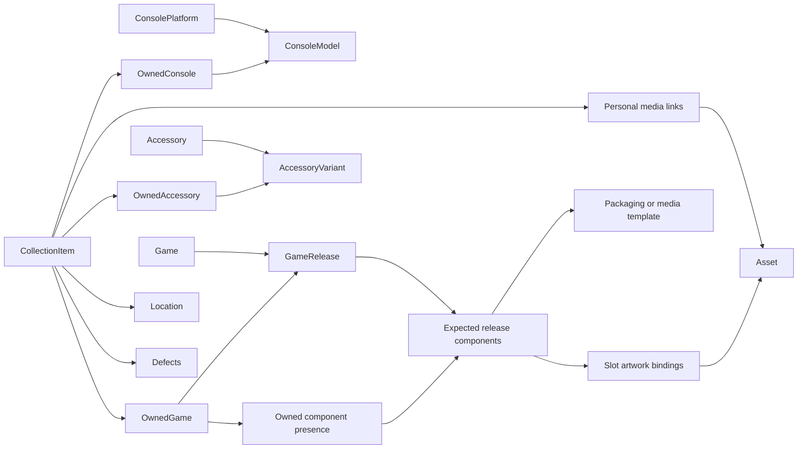

# GemuKore — Architecture Review

Task: **0.1 — Review the Complete Product Specification**  
Date: **2026-09-28**  
Decision update: **2026-09-29**  
Status: **C01–C17 resolved and incorporated into the source documents; Task 0.2 design is documented in DOMAIN_MODEL.md.**

## 1. Scope and conclusion

At the original review, read in full: `AGENTS.md` (86 lines), `PROJECT_SPEC.md` (3,996 lines), and `DEVELOPMENT_PLAN.md` (2,990 lines). The repository then contained those documents, a minimal README, and logo assets; there was no application or database implementation to assess. References below use specification section numbers and development task numbers. Later documentation changes preserve those numbered references.

This is the Task 0.1 design review. The user reviewed C01–C17 individually and selected Option A for each. Section 3 records those accepted decisions and their scope. During the authorized continuation on 2026-09-29, the specification and development plan were reconciled with those choices, and [DOMAIN_MODEL.md](DOMAIN_MODEL.md) was produced for Task 0.2. No application code, migrations or dependencies were created. The findings below retain their review-time reasoning; the domain model develops the detailed proposals. Other recommendations are not represented as individually user-approved merely because C01–C17 were accepted.

**The foundation is sound: retain a modular Next.js application, PostgreSQL, Prisma, S3-compatible storage, and a strict distinction between canonical products and physical copies.** Preserve `ConsolePlatform → ConsoleModel`, `Game → GameRelease`, `Accessory → AccessoryVariant`, and shared `CollectionItem` composition.

The specification is not yet precise enough to implement the core schema safely. Its main risks are product identity, incomplete physical-edition relationships, unconstrained composition, and publication rules that stop at database fields rather than covering assets and derived responses. Resolve these before Task 4.1. The project does not need microservices, a universal catalog framework, a queue, or a comprehensive videogame ontology.

Priority meanings in this review:

| Priority | Meaning |
| --- | --- |
| High | Resolve before the relevant schema or security boundary is implemented. |
| Medium | Resolve when designing the affected feature; avoid prematurely building a general framework. |
| Low | Clarification or simplification with limited migration risk. |

There are no claimed critical production vulnerabilities: no application exists. High findings describe consequential design risks, not observed exploits.

## 2. Architectural findings

### A01 — Canonical identity needs explicit rules

**High — Spec §§2, 19–32, 48–57, 94, 106.**

The catalog/copy distinction is correct, but names, slugs, edition labels, model numbers, and regions do not define identity by themselves. Two physical releases can share game, platform, region, and edition name while differing in product code, packaging, language, or print revision. Conversely, differing regional names need not mean different platforms. A copied catalog row for every owned object would defeat the design.

Recommended rules:

- Give every catalog entity a stable internal ID. Treat slugs as navigation keys and external IDs as source mappings, not universal identity.
- Treat `ConsolePlatform` as a software/hardware ecosystem, with aliases for regional branding when appropriate. A platform is not a promise that every game or accessory works on every model.
- Treat `ConsoleModel` as an identifiable hardware configuration/revision, including meaningful regional electrical or mechanical differences. Color/limited-edition distinctions can live here initially; do not add a third hardware-variant level yet.
- Treat `Game` as the editorial identity of a game. Ports can share it; materially distinct remakes are separate games. Define this as a curation policy rather than pretending an external provider determines it perfectly.
- Treat `GameRelease` as an identifiable physical commercial release for one platform, with its edition, market coverage, product identifiers, and expected contents. A different collectible printing or package can be another release even when its edition label is unchanged.
- Treat `Accessory` as a product family and `AccessoryVariant` as a concrete version, revision, color, or edition. Use a named standard variant for genuinely variantless products.
- Treat one `CollectionItem` as one owned copy or purchased physical set. Two copies of the same release have two IDs, with independent photos, locations, and defects.

Do not enforce a unique game-release constraint solely on `(game, platform, region, editionName)`. Prefer stable IDs, scoped known identifiers, duplicate warnings, and deliberate administrative correction. Unknown identity must remain possible without fabricated metadata: allow incomplete admin-created catalog records, make unresolved fields visible, and require a catalog target for each saved owned subtype. A full provisional-record approval workflow can wait.

A model should not be selected silently merely because it is the only model currently catalogued (§24). Show the selection and permit an unknown/incomplete identification path; the local catalog may be incomplete.

### A02 — Collection composition lacks an integrity contract

**High — Spec §§54–57, 106.**

Three one-to-one relationships alone do not guarantee that each `CollectionItem` has exactly one subtype matching its `type`. An item could have no subtype, several subtypes, or a `GAME` discriminator with an `OwnedConsole` record. Those states corrupt unified search, counts, permissions, and deletion.

Keep composition, with these invariants:

1. Each subtype uses `collectionItemId` as its primary key and foreign key.
2. Each item has exactly one subtype, matching its immutable type.
3. Creation and deletion are atomic across the root and subtype. A failed subtype write leaves no parent item.
4. Owned records reference catalog models/releases/variants; catalog records never reference a single owner or copy.
5. Deleting a copy removes its dependent defects and media links, never its canonical product or shared asset bytes.
6. Referenced catalog records cannot be deleted casually. Correct them or explicitly reassign references; do not cascade catalog deletion into the collection.

Task 0.2 must choose the enforcement mechanism. Recommended: foreign keys and uniqueness for ordinary relationships, subtype/type agreement enforced structurally where practical, and a small deferred database constraint trigger for the remaining exactly-one invariant, alongside transactional services. Test inserts, subtype deletion, type changes, and concurrent writes. A normal cross-table `CHECK` is not sufficient: PostgreSQL checks are row-local; constraint triggers can defer enforcement to transaction end. [PostgreSQL constraints](https://www.postgresql.org/docs/current/ddl-constraints.html), [constraint triggers](https://www.postgresql.org/docs/current/sql-createtrigger.html).

The alternative is a single item table with three exclusive nullable catalog foreign keys and row-local checks. It is simpler at the database level, but abandons the specified subtype composition and spreads category-specific fields onto the root. Retain the specified composition unless Task 0.2 deliberately chooses that tradeoff. Avoid ORM inheritance frameworks and generic entity registries.

### A03 — Catalog facts and copy facts can contradict each other

**High — Spec §§22, 24, 29, 32, 47, 50–57.**

`ConsoleModel.regionId` and `OwnedConsole.regionId` have no stated precedence. Selecting a `GameRelease` and then independently choosing region and edition implies that those properties can change without changing the release. Accessory creation likewise mixes canonical producer/compatibility with personal fields.

Recommended boundary:

| Canonical fact | Owned-copy fact |
| --- | --- |
| Model/revision, release edition, product code, markets, producer, compatibility, expected contents | Serial number, observed identifying markings, actual contents, location, defects, private notes, personal photos |
| Default artwork, logo, geometry and textures | Explicit personal display overrides and photographs |

Choose platform/game/market/edition to **find or create a release**, then select that release. An existing release makes its canonical fields read-only in the add-copy flow. Changing those facts means selecting another release or making a separate authorized catalog correction.

Remove an independent authoritative copy region. If collectors need to record uncertain or conflicting markings, retain an explicitly named observation/identification note; it must not silently override catalog identity. A regional hardware mismatch should prompt re-identification, not produce two competing truths.

Product numbers and serial numbers are different: product numbers identify a commercial version; serial numbers identify individual units. Add appropriately scoped catalog product identifiers, preserve leading zeros, and allow copy-specific observed markings. Do not make all serial numbers globally unique.

### A04 — Region mixes three independent concepts

**High — Spec §§22, 29, 50, 55, 71, 97.**

The specification explicitly separates TV format from commercial region, but lists `Region Free` alongside markets. Region-free describes compatibility/locking, not distribution. A worldwide release can have restrictions; a region-free product can have Japanese packaging.

Use `Region` as a small controlled **commercial market** vocabulary. Country markets, broad market groups, and Worldwide are acceptable labels for this hobby catalog; do not build a geographic hierarchy or silently infer country membership. Remove Region Free from market seed data. Keep these concepts separate:

- Commercial market coverage: explicit relational links from models, releases, and variants to one or more regions.
- Region-lock behavior: a separate optional controlled property when relevant; unknown is distinct from unrestricted.
- TV/video standard, voltage and plug details: hardware specifications, with typed fields only where actual filtering requires them.
- Packaging/software languages: optional release facts, not inferred from market or TV standard.

Multiple market links avoid cloning an identical product solely because it was sold in several places. A market-specific physical difference warrants a distinct model/release/variant. An unknown market is missing information, not Worldwide. If launch dates differ by market, store them with the release-market association when needed; label any summary date as the earliest known date rather than inventing a single universal date.

### A05 — Company roles and accessory compatibility have insufficient cardinality

**High for compatibility; Medium for credits — Spec §§20–22, 28–29, 49–53; Plan Task 16.1.**

One `Company` table is correct. Single `publisherId` and `producerId` fields cannot represent co-publishers, outsourced development, or regional publishing roles. A manufacturer on both platform and model needs defined semantics. Compatibility only at the accessory-family level incorrectly asserts that every variant supports every platform.

Recommended:

- Use explicit game-company and release-company credit relationships with role. Conceptual development credits belong to `Game`; port development and physical-release publishing credits belong to `GameRelease`. Keep the scopes visible instead of merging them into an unexplained company list.
- Use platform manufacturer as its primary brand/manufacturer attribution; model manufacturer describes actual hardware manufacture when known. Never imply the two must match. Family producer and variant producer can follow the same explicit-default convention.
- Put authoritative accessory/platform compatibility on `AccessoryVariant`. The accessory family view may show the union of variants, clearly labeled. Family compatibility can prefill a new variant but should not be a second editable source of truth.
- As accepted in C10, shared descriptions, specifications and video belong to the accessory family; variants may supply specific differences. A new variant may copy another variant's compatibility list for review, but its saved compatibility is explicit rather than dynamically inherited.
- Express only confirmed direct compatibility initially. Model-specific restrictions and adapter requirements can be documented as notes until a real structured query needs them. Do not infer compatibility transitively or construct a universal connector protocol system.
- Keep company country separate from product commercial region. Permit unknown company details. Defer mergers, subsidiaries and historical corporate identity graphs.

One primary manufacturer per hardware record is sufficient initially; use multiple credits only where needed. A single universal `CompanyRole(entityType, entityId)` table would trade simple foreign keys for unnecessary polymorphism.

### A06 — The physical edition is missing its component relationships

**High — Spec §§29, 31, 41–45, 47, 54; Plan Task 14.1.**

`GameReleaseIncludedItem` describes expected extras, but `hasBox` cannot say whether a manual, second disc, or collector's item is actually present. One packaging template and one media template per release cannot adequately represent an outer collector box, inner case, and three separately labeled discs. Slots exist, but the release-to-slot-to-asset bindings do not.

Recommended small extension: develop `GameReleaseIncludedItem` into a flat **release-component list** with a kind such as packaging, media, manual, or extra, plus quantity and order. A packaging component may reference a `PackagingTemplate`; a media component may reference a `PhysicalMediaTemplate`. Keep named components without a template fully usable.

- A release has zero or more components. Each geometrically distinct component uses at most one appropriate template.
- Distinct disc labels or shapes use distinct component rows. Quantity is for interchangeable copies of the same component, not differently illustrated discs.
- Explicit packaging/media texture-binding records connect a component, a slot belonging to its template, and an `Asset`. Enforce uniqueness per component/slot and reject slots from unrelated templates.
- A lightweight owned-component record links the copy to an expected component and records present quantity or unknown, optionally with a note. Missing manual and damaged manual are different conditions.
- Keep `hasBox` as a convenient yes/no/unknown summary until components are implemented; define it as possession of the release's designated primary package. Once component tracking is active, derive it or update it atomically from that component. Never maintain two independent editable answers.
- Defects may optionally target an owned component later; the owning `CollectionItem` remains the aggregate root.

Do not build nested bills of materials, a general inventory engine, or independently located parts in the MVP. Every component shares the copy's location initially. A box-only acquisition or separately stored manual needs an explicit later product decision rather than being incorrectly modeled as a complete game copy.

This extension corrects a domain omission; it does not require implementing physical component UI or renderers in Task 0.1 or Task 4.1. Task 0.2 should settle the relationships, and later migrations introduce the feature.

### A07 — Assets need ownership, usage, derivation and lifecycle rules

**High — Spec §§13–15, 38, 42–45, 61, 91–92, 108, 124.**

`Asset` currently combines a stored file with its presentation role. The same image can be a cover, a gallery image, and a packaging texture. `publicSafe` alone cannot express whether a photo is private, whether distribution is permitted, or whether a particular placement is approved. `CatalogAsset` is named but undefined; console/accessory galleries have no specified relationships.

Recommended responsibilities:

| Concept | Responsibility |
| --- | --- |
| Asset | Stored bytes, generated storage key, validated media type, dimensions/size/hash, lifecycle state, source and rights metadata. |
| Asset usage/link | Typed owner, role, order, caption/alt text, and publication approval for that use. |
| Derivative | Another asset with a source-asset link and transform purpose, such as a thumbnail or sanitized public image. |
| Display resolver | Selects the appropriate approved personal override, catalog default, or fallback for the current audience. |

Treat kinds such as IMAGE/VIDEO/MODEL as file categories; FRONT/LOGO/COVER/SCREENSHOT describe uses. Avoid two overlapping classification systems with contradictory values. Retain explicit `CollectionItemMedia` and catalog links; either typed catalog link tables or a bounded table with real nullable foreign keys and exactly-one-owner checks is reasonable. Define that choice in Task 0.2. Do not create an unconstrained `entityType/entityId` link.

Expand provenance to cover provider/source identity, author when known, retrieval time, usage restrictions, reviewer, and review time. `publicSafe` can remain the conservative publication-eligibility decision, default false, but is not an assertion that all uses are licensed and is not item visibility. Derived crops, resized images and rendered 3D previews retain source lineage and the applicable publication restrictions. AI-assisted processing does not erase the source asset's provenance.

Use private storage by default. Authorize upload initiation, completion, attachment, read, and deletion. Validate actual file content as well as declared MIME/extension; enforce resource limits before expensive processing. An upload is not usable until server verification succeeds. Keep originals private and generate sanitized display derivatives that omit EXIF/GPS and identifying filenames.

Database transactions cannot atomically commit object-store writes. Use a small lifecycle such as pending/ready/failed, immutable object keys, retryable completion, and an explicit cleanup/reconciliation operation for abandoned uploads or deletions. Delete unreferenced bytes only after checking all uses. A checksum may identify equal content but must not confer permission across uses or users. No queue is required to start.

One configurable S3-compatible adapter is sufficient; test MinIO and the selected production service. Do not build five independent providers before using them. Keep external video references separate from locally stored assets and never assume an externally accessible URL is approved for publication.

### A08 — Public privacy must cover every output path

**High — Spec §§62, 69, 79–86, 109–110, 134–135; Plan Phase 18.**

Dedicated public queries are the right approach. The remaining gaps are item-level visibility, media approval, indirect asset access, route overlap, and cached or derived outputs. Global `showPersonalPhotos` must not make every serial-number photograph publishable.

Recommended policy:

1. Public collection disabled by default. An item also has an explicit publication choice, private by default. Enabling the collection does not automatically publish every new acquisition.
2. Public query projections select only permitted fields, never raw private Prisma objects or arbitrary metadata JSON.
3. Asset delivery requires all applicable conditions: collection enabled, item visible when applicable, permitted usage, approved asset eligibility, and the relevant public setting. Public 3D requires approved geometry, textures and previews.
4. A hidden serial must remain hidden in photo pixels, captions, filenames, metadata, and thumbnails. Serial-classified media is private by default; require reviewed sanitization before publishing it. The same principle applies to location clues.
5. Hidden fields cannot influence public search matches, suggestions, counts, facets, sorting, or error details. Searching a private serial must not reveal that an otherwise public item exists.
6. Public metadata, OpenGraph images, sitemaps, download handlers and media endpoints use the same publication policy. Public counts include only published items.
7. Start with uncached publication-sensitive responses or explicitly bounded caching. Revoking publication invalidates any application caches and stops issuing asset access. Previously downloaded files cannot be recalled; any signed-URL lifetime defines a known residual-access window.

Keep `showSerialNumbers`, `showLocations`, `showNotes`, `showDefects`, and `showPersonalPhotos` false by default. If enabled later, still apply item/media-level publication decisions. Prefer a curated public location label over exposing the private hierarchy, and a separate public description over repurposing private notes. Those refinements can replace broad toggles after a deliberate product decision; they are not implied existing requirements.

Reserve `/collection/...` for public browsing and use `/app/...` for private collection management. Authentication never changes the data contract of the public URL. A catalog slug does not identify an individual physical copy: public detail routes must include a stable unique item identifier, optionally with a decorative title slug.

Privacy design must start before uploads and search, even though the public UI arrives in Phase 18. Robots/noindex is a discovery preference, not access control.

### A09 — Authorization conflicts with the proposed creation and enrichment flows

**High — Spec §§10–12, 32–37, 51–52, 93, 123.**

Editors may manage copies and run enrichment, but only administrators may modify the catalog. Creating a release while adding a game and accepting enrichment into a release are catalog mutations.

Preserve the written permission boundary:

| Operation | ADMIN | EDITOR | VIEWER |
| --- | --- | --- | --- |
| Read private collection | Yes | Yes | Yes |
| Manage copies, defects, locations and personal media | Yes | Yes | No |
| Run enrichment and review suggestions | Yes | Yes | No |
| Create/edit catalog facts or accept canonical changes | Yes | No | No |
| Manage grants and public settings/publication | Yes | No | No |

Editors can select existing catalog records and produce suggestions for an admin. Initially, an editor encountering a missing release can request an admin to add it outside the application; a catalog-request inbox is not required. An admin's add-copy flow may expose a distinct catalog-create step with explicit authorization. Do not grant implicit catalog writes through a collection action or upload endpoint.

For authentication, normalize verified email conservatively, make grants unique, fail closed when verified email is unavailable, and re-evaluate current grant status/role at private reads and mutations. Revoking a grant must not leave an old session authorized indefinitely. Define first-admin bootstrap and account-linking rules in Task 3.1. “No public registration” means OAuth authentication never grants private access by itself; any auth-library record created during a rejected login must remain unauthorized.

### A10 — Enrichment history is not yet a safe acceptance workflow

**High — Spec §§33–37, 96, 98–100; Plan Phases 12–13.**

A run-level `result` and `acceptedData` cannot by themselves guarantee field-level provenance, partial decisions, stale-write detection, or permissions. `COMPLETED` is ambiguous: did retrieval finish, did review finish, or were changes applied? A provider game match does not establish an exact regional physical release.

Use a bounded server-side workflow:

**explicit target → candidate matching → normalized proposals → user review → authorized transactional acceptance.**

- Separate provider lookup from optional AI synthesis. Share normalized DTOs and acceptance logic; do not force manual input, an LLM and a structured database into an identical search/fetch implementation.
- Persist candidate choice and its granularity: a conceptual game match cannot automatically supply the cartridge label, edition contents, or market-specific box art for a release.
- Each proposed change identifies target, field, old/base value or version, suggested value, source references, and optional confidence. Confidence is supporting information, not proof of truth or a substitute for evidence.
- Distinguish retrieval state from review state. Review supports pending, accepted, rejected and conflict outcomes per suggestion. Retrying retrieval creates another attempt or leaves earlier decisions intact.
- On apply, reauthorize and compare the current catalog version with the preview baseline. Changed fields return a conflict for renewed review. Apply only explicit selections, atomically, and make repeat submission idempotent.
- Keep a targeted change/provenance record for enrichable fields, including actor, time, origin (manual/seed/provider/AI-assisted), prior value, accepted value and source/run reference. This is not full event sourcing or a universal EAV domain model.
- “Apply all” means all displayed eligible proposals at the reviewed version, including explicit acknowledgement of manual-value replacements. It never accepts newly arrived or hidden proposals.
- Treat provider text, web content and model output as untrusted data. Validate structured output, use an allowlist of mutable fields, and give AI no direct database-writing capability. Exclude serials, locations, private notes and photos from provider requests unless a future explicit feature needs them.
- Limit request duration, candidate count, retries, asset fetches and cost. A timed-out run is recoverable/failed, not a successful background task. Do not fire-and-forget work after returning the response.

Start with one structured provider and optional bounded AI completion of missing facts. Reuse orchestration for accessory-specific DTOs/adapters later. Missing data is a successful possible result. External fetches need a constrained server fetch policy, including protection against requests to internal network addresses and unsafe redirects.

### A11 — Generic external references have no referential integrity

**High — Spec §§37, 96, 106, 108.**

`entityType/entityId` does not provide a foreign key to the actual entity. It can point to a deleted or wrong-kind record, conflicting with the explicit-relationships rule. `CatalogAsset` and enrichment targets face the same design choice.

As accepted in C07, use a bounded set of nullable target foreign keys with an exactly-one-target constraint for shared reference/run records. Use explicit specialized links where the relationship has additional domain meaning. Avoid introducing a universal `CatalogEntity` superclass solely to shorten these tables. Task 0.2 will enumerate the supported targets and their deletion rules.

Separate external identity from provenance: an external ID maps a provider record; a source URL supports a claim. Include provider object type when IDs are only unique within that type. Do not force a provider's single game record to map uniquely to one physical release; attach broad identities to `Game` and record release-specific evidence separately. Preserve audit target snapshots when retaining history after deletion, with a documented deletion policy rather than broken live links.

### A12 — Locations and defects need small, explicit invariants

**Medium — Spec §§58–61, 71, 74.**

Keep `Location` as an adjacency-list tree. Permit an unassigned item location; never manufacture a fake shelf for unknown data. A location cannot parent itself or any descendant. Serialize/lock hierarchy moves sufficiently to prevent two concurrent individually valid moves creating a cycle. Deletion is allowed only with no children and no item references, unless a separate explicit move operation has emptied it first. Do not cascade a location deletion into items.

Use stable IDs for relationships and derive breadcrumbs; names and paths can change. Define sibling-name and ordering conventions in Task 0.2. Do not add closure tables or materialized paths before measured queries justify them. Location type is descriptive rather than a rigid nesting law.

Defects belong to a copy, not a canonical product. Current severity mixes a kind (`COSMETIC`) with impact levels (`MINOR` through `CRITICAL`). Prefer a separate small category (cosmetic/functional/missing-part/other) and severity (minor/major/critical, optionally unknown). A missing edition component should use presence tracking rather than a duplicate defect unless there is an actual fault to document.

Define `ACCEPTED` as an acknowledged, unresolved defect. “Has defects” should include ACTIVE and ACCEPTED; “active defects” in the dashboard can remain strictly ACTIVE if labeled that way. REPAIRED defects remain in history and do not count as unresolved. A repair note and resolved timestamp are sufficient initially; a repairs/work-orders system is out of scope.

### A13 — Descriptive metadata needs scope and uncertainty

**Medium — Spec §§28–29, 36, 38–40, 49–53, 71.**

Ratings could mean review scores, community ratings, personal scores or age classifications. Playtime often describes a game or platform version rather than a boxed edition. Screenshots and trailers have the same scope problem. The playtime source URL/timestamp requirement is absent from the proposed release fields. Accessories request specifications and video without corresponding modeled fields.

Define the first displayed rating as a sourced review/community score with a scale, source URL and observed timestamp. Keep personal ratings and age classifications separate if later requested. Validate values against their scales and compare/filter normalized scores only where semantics match. Unknown is not zero.

Attach general descriptions, screenshots, trailers and playtime to `Game` where the source applies generally; allow explicitly scoped release data when supported by evidence. Prefer a simple, documented fallback from release to game over duplicating imported data for every physical edition. Store whether a value is inherited in the view DTO, and never falsely label it release-specific.

C08 accepts one currently selected set of playtime estimates (main story, main plus extras, completionist), with its source, optional source URL and recorded/updated timestamp. Manual estimates are allowed and marked as manual; missing estimates remain unknown rather than zero. Imported replacements follow enrichment review. Multiple competing source sets and source-selection UI are outside this initial design. The precise game-versus-release attachment remains a Task 0.2 decision; accepting C08 did not settle that separate scope question.

Support incomplete dates (year, month or exact date with precision) instead of fabricating January 1. Preserve the distinction between missing values and confirmed negatives. Use validated, versioned JSON for sparse hardware specifications and presentation settings; use columns/relations for identities, permissions, targets, frequently filtered fields and lifecycle states. Units for dimensions and weight must be explicit and consistent.

### A14 — Template reuse is sound, but its contract must be versioned

**Medium — Spec §§16–18, 41–45, 124; Plan Phases 9 and 14.**

Keep `PackagingTemplate` and `PhysicalMediaTemplate` as separate domain concepts. They can share renderer utilities without becoming a general scene-authoring system. Templates describe geometry, dimensions, slot definitions, materials and camera defaults; release components supply artwork; owned photos/overrides remain separate.

Define units, axes/orientation, material/UV slot matching, texture aspect/transform policy, and required versus optional slots. A front cover is not automatically a complete box texture. Missing artwork produces a neutral surface or static fallback, not guessed imagery. Templates are optional: a release remains a valid physical product without renderable assets.

Once referenced, changes to geometry/material names/UV contracts should create a new template revision (initially another template row), with explicit reassignment. Cosmetic camera adjustments may remain mutable. Avoid silent breakage of every release using a template.

Use GLB-only ingestion initially, resolving the specification's broader GLTF allowance as a later extension. Require self-contained, validated models; constrain texture dimensions, file size, scene complexity and remote dependencies. Validate derived thumbnails and all textures under the same publication policy as the source model.

`ModelViewer` should receive a validated presentation description, not a Prisma entity. Load its Three.js client boundary on demand; grids use static images. Prefer one active viewer, explicit resource/cache ownership and cleanup, bounded rendering resolution, pause when hidden, and a static fallback for unsupported devices/errors. Reduced motion disables auto-rotation, and controls must remain usable without gestures. Choose numerical budgets using real target phones in Task 9.1 rather than inventing performance guarantees now.

## 3. Accepted resolutions for C01–C17

The user selected **Option A for every item**, one at a time. All 17 decisions are resolved at the architectural level. The table preserves the original source locations and records the accepted outcome. Some original findings were direct contradictions; others were underspecified requirements. Acceptance resolves the direction, not the detailed schema or implementation.

| ID | Source locations | Original conflict or gap | Accepted resolution — Option A |
| --- | --- | --- | --- |
| C01 | Spec §§62, 79, 134–135 | `/collection` is both the private view and public collection. §135 acknowledges this conflict. | Reserve it for public pages; private pages under `/app`. |
| C02 | Spec §§80, 109–110 | `publicCollectionEnabled` appears in both settings models. | `PublicSettings` owns the only publication toggle and all public visibility settings. `AppSettings` owns general preferences. |
| C03 | Spec §§12, 32, 34–35, 51, 93 | Editors may enrich/manage copies, while release creation and acceptance change an admin-only catalog. | Separate proposing from applying; canonical mutations remain admin-only. |
| C04 | Spec §§29, 32, 56; Plan Task 11.2 | Release is selected before independently selecting its region and edition. | Guided flow: platform and game → optional market/edition filters → release selection → personal-copy details. Selected release facts are fixed; changing market or edition selects another release. Admins can create a missing release. |
| C05 | Spec §§22, 24, 55 | Console region appears on model and copy without precedence. | Canonical markets plus optional observed copy markings, not two authoritative region fields. |
| C06 | Spec §97 | Region Free is listed as a region despite the warning against conflating market and technical concepts. | `Region` describes commercial markets only, with multiple market links allowed. Locking is separate; video standards belong to hardware specifications. Unknown is not Worldwide. Structure additional technical fields only for concrete filtering needs. |
| C07 | Spec §§37, 96, 106 | Polymorphic IDs are proposed alongside required foreign keys and explicit relationships. | Shared references/runs use explicit target foreign keys with exactly one populated target. Dedicated relationships remain appropriate for domain-specific links such as texture bindings; no universal catalog superclass. |
| C08 | Spec §§29, 40 | Playtime requires sources, source URL and update time, but release fields omit most of them. | One selected set of estimates, with source, optional URL and recorded/updated timestamp. Manual estimates are identified as manual; unknown durations stay blank. Imported changes require review. Game-versus-release scope remains for Task 0.2. |
| C09 | Spec §§29, 31, 43, 45, 108 | Slots and edition contents exist, but artwork bindings and multiple physical instances do not; media slots are only named in the model inventory. | Flat expected-component list per release. Each component can optionally reference a packaging/media template with explicit slot artwork bindings. Owned presence is separate. No nested component hierarchy and no requirement for every component to have 3D. |
| C10 | Spec §§49–53, 108 | Accessory specifications/video and variant compatibility are requested but not fully modeled. | Shared descriptions, specifications and video belong to the accessory family; variants provide specific differences. Compatibility is explicit per variant; copying a list when creating a variant requires review. |
| C11 | Spec §§16, 124 | Viewer formats allow GLTF, but initial upload formats list only GLB. | Accept self-contained GLB only in the MVP. GLTF package handling and automatic conversion are deferred. |
| C12 | Spec §§14–15, 84–85, 92 | A global public-safety bit and photo toggle do not resolve private originals, derivatives, pixel content or direct storage access. | Collection toggle plus explicit item and media approval. New items/media start private; originals stay private, with approved display versions served publicly. Direct asset access follows the same rules. External-asset public-use eligibility remains a separate check. |
| C13 | Spec §§138–150, 157; Plan Phases 0–24 | Two phase numbering systems; Spec Phase 0 bootstraps code, Plan Phase 0 performs architecture. The old first prompt would implement code during this task. | `DEVELOPMENT_PLAN.md` task IDs govern execution. Retain spec phases as a clearly labeled, non-executable roadmap; revise the obsolete first prompt to point to the plan when reconciling the source documents. |
| C14 | Spec §151; AGENTS.md; Plan workflow | Spec says one phase at a time; AGENTS and plan say one task. | Complete the named task, including necessary fixes and checks within its scope. Do not automatically start another task or unfinished prerequisite; scope expansion requires explicit authorization. Multiple tasks may be explicitly authorized together. |
| C15 | Plan Tasks 4.1, 8.1, 11.1, 16.1 | Core schema is implemented first, then later tasks again say to implement domain entities. | Task 4.1 builds agreed core tables; later tasks add feature services/UI and only approved feature-specific schema additions. |
| C16 | Plan Tasks 4.1, 5.1, 14.1, 18.1 | Core schema precedes detailed asset, template and privacy design. | Set domain/privacy contracts in 0.2; defer optional tables until their feature instead of freezing guessed designs in 4.1. |
| C17 | Plan Task 11.2 versus Phases 12–13 | Game creation includes enrichment before provider/enrichment services exist. | Task 11.2 delivers a complete manual creation flow within catalog permissions. Add optional enrichment during Phases 12–13, both during creation and afterward. Saving a valid copy never depends on provider availability; no unfinished enrichment control is required. |

**Follow-through completed on 2026-09-29:** C01–C17 are incorporated into `PROJECT_SPEC.md` and `DEVELOPMENT_PLAN.md`. [DOMAIN_MODEL.md](DOMAIN_MODEL.md) supplies the Task 0.2 conceptual model and core-versus-deferred schema scope. No application work is implemented, and no further choice among the alternatives presented for C01–C17 is pending.

The visual instructions are not a fundamental contradiction: “core dependency” and “use extensively” can coexist with purposeful restraint. Treat the long component lists as suggestions rather than a requirement to install and animate every surface.

## 4. Final recommended high-level architecture

### 4.1 Application shape

Use one deployable **modular monolith**: Next.js serves the private application, public museum, server actions and necessary route handlers. PostgreSQL holds relational data; an S3-compatible service holds media. Continue with the proposed authentication and UI stack. No separate API server, microservices, Redis, search service, event bus or worker is needed initially.

The modules are:

| Module | Owns |
| --- | --- |
| Identity and access | OAuth/session integration, verified-email grants and server permissions. |
| Catalog | Companies, markets, platforms/models, games/releases, accessories/variants and their canonical relationships. |
| Collection | Owned-item aggregate, subtype composition, actual contents, defects and locations. |
| Media | Storage lifecycle, asset provenance, derivatives and typed usages. |
| Enrichment | Provider adapters, candidate matching, proposals, review and accepted-change provenance. |
| Presentation/3D | Reusable templates, slots, texture bindings and audience-safe viewer descriptions. |
| Public collection | Publication policy and narrow public queries, including public search and media access. |

Use server-only services for transactions, policy and business behavior. Repositories own query shapes and persistence. Route handlers/actions validate inputs and obtain server identity before delegating. UI consumes narrow DTOs. Keep repositories concrete and small; do not invent an interface and pass-through class for every entity or a generic CRUD service.

### 4.2 Domain overview

Arrows show associations, not automatic delete cascades. The three subtype branches under `CollectionItem` are **exclusive**, not three simultaneous children. Company credits, market links, external references and provenance are omitted from the diagram for readability, not from the architecture.

### 4.3 Rendering and privacy boundaries

Private screens use authenticated private queries. Public screens use a separate projection and publication policy even for logged-in visitors. Private item overrides are resolved only in private views unless explicitly approved for public use. Public rendering may independently fall back to eligible canonical artwork; it must never accidentally inherit a private override.

Server Components provide the default page structure. Forms, galleries, drag ordering, purposeful animation and 3D are focused client components. The heavy 3D boundary is reached only on demand, with static images providing the baseline experience. The catalog and collection remain useful when enrichment providers, AI, or 3D are unavailable.

### 4.4 Persistence and future changes

Use UUIDs, real foreign keys, deliberate uniqueness, relevant indexes, and explicit delete behavior. Keep relational identity out of JSON. JSON is appropriate for bounded specifications, camera/material settings, raw provider snapshots and validated suggestion payloads; it is not the authoritative store for access rules or relationships.

Seed entries need stable seed keys. Idempotence means reruns do not duplicate records; it does not authorize replacing later manual edits. Seed updates should be insert-only or explicitly reviewed where they touch edited fields.

Use PostgreSQL search and pagination. Define the searchable public projection separately from private notes, serials and defects. Begin with straightforward indexed queries; do not introduce a duplicate search document per item until real query measurements justify it. Catalog edits must not leave stale collection search results if denormalization is introduced later.

Do not add `Collection`/`CollectionMember` now, consistent with §3. Keep catalog data global and collection-owned information concentrated behind the collection boundary. A future migration can create a default collection and backfill its ID into items, locations, settings and private asset ownership, then introduce membership. That will require migrations and permission work, but no redesign of `Game`, `ConsoleModel` or `AccessoryVariant`. Uploader/creator IDs are attribution, not individual ownership.

Back up the database and media together with a tested restoration procedure. Persist generated originals/derivatives outside ephemeral containers. Retain small structured operational logs without private query contents, serials, provider credentials or signed URLs by default.

## 5. Missing concepts: minimum additions versus future work

| Concept | Recommendation |
| --- | --- |
| Product identification | Add scoped product codes and identity/alias conventions; do not confuse them with serial numbers. |
| Publication choice | Add per-item and per-media-use approval; keep collection-level settings as gates. |
| Actual versus expected contents | Design the component/presence relationships now; implement them with the physical-edition feature. |
| Artwork binding | Required when implementing templates; slot lists alone are incomplete. |
| Uncertainty | Allow unknown market, date precision, unknown box state and incomplete identification. |
| Provenance and concurrent edits | Track accepted field changes and baseline versions for enrichment. |
| Asset lifecycle and derivatives | Required with uploads; include cleanup and original-to-derivative lineage. |
| Compilation contents | Initially a compilation can be its own `Game`; an optional contained-games relation can follow. Never force one physical release to be duplicated once per included title. |
| Hardware bundles and installed accessories | Defer structured relationships; keep separate owned items and notes until bundle grouping is requested. |
| Condition, acquisition, repairs, valuation | Preserve the future roadmap. Defects and box presence do not equal a condition grade; do not add a financial/repair subsystem now. |
| Export/import | Backups and restore are required; portable inventory export remains a later feature. Keep stable IDs and media references to support it. |

## 6. Unnecessary complexity to avoid

The main scope problem is breadth, not the core entity splits. Keep the splits because they prevent duplicate metadata and preserve physical identity. Simplify the machinery around them.

- **Do not recreate a complete game database.** Seed a small relevant hardware catalog and add releases as the collection needs them.
- **Do not add universal entity, metadata, role, workflow, or provider frameworks.** Explicit tables and a few adapters are more understandable here.
- **Do not implement full multi-tenancy early.** A later default-collection backfill is acceptable.
- **Do not introduce event sourcing.** Targeted enrichment provenance and ordinary timestamps satisfy the immediate need.
- **Do not implement a 3D editor.** Curated templates, versioned slots, one packaging format and one media format establish the contract.
- **Do not implement every S3 provider independently.** Configuration plus compatibility checks suffice.
- **Do not turn the add-item wizard into a prerequisite for basic saving.** Keep enrichment, photos and 3D optional; support saving a valid copy before enrichment completes.
- **Do not build every animation listed in the specification.** Establish a card, entrance and statistics convention; expand only where useful.
- **Do not add repair histories, barcode recognition, valuations, regional taxonomies or compatibility graphs before actual use requires them.**

Recommended delivery slices are: (1) usable private inventory across all three categories with manual catalog data, assets, search, locations and defects; (2) bounded enrichment and first 3D templates; (3) explicitly curated public museum and release hardening. These are incremental usable milestones within the written MVP ambition. Removing enrichment, 3D or public mode from the formal MVP would be a product scope change and is **not** assumed by this review. Execution still follows one approved development-plan task at a time.

## 7. Domain-design follow-through before implementation

Task 0.2 should carry forward the accepted C01–C17 resolutions without reopening their alternatives. The table below also includes broader review recommendations that were not separately approved by those choices. It is a design checklist, not a claim that the user approved every mechanism in the original review. In particular, exact composition enforcement, identity constraints, defect semantics, provenance/concurrency mechanics and authentication details still need design decisions. Reconcile affected source requirements before code depends on them.

| Decision | Recommended default | Needed by |
| --- | --- | --- |
| Product identity and unknown identification | Explicit canonical identities; incomplete records allowed; physical releases distinguished by meaningful commercial differences. | Task 0.2 / core schema |
| Composition enforcement | Keep subtypes; atomic services plus DB enforcement of matching exactly-one subtype. | Task 0.2 / 4.1 |
| Region semantics | Markets via explicit links; separate locking, video standard and language; no copy-region override. | Task 0.2 |
| Release/company/compatibility scope | Scoped company credits; authoritative accessory compatibility on variants. | Task 0.2 |
| Physical contents | Flat expected components and later owned presence; typed artwork bindings; no nested inventory engine. | Task 0.2 relationships, Phase 14 feature |
| Box and defect semantics | Unknown box state allowed; explicit unresolved-defect rule; cosmetic category separate from severity. | Task 0.2 / Phase 6 |
| Catalog authority | ADMIN applies canonical changes; EDITOR may generate proposals and manage owned copies. | Task 0.2 / 3.1 |
| Public identity and routes | Public `/collection`; private `/app`; unique copy identity in public detail URLs. | Task 0.3 |
| Publication and media policy | Private by default; item, usage and asset eligibility gates; originals private. | Task 0.2 / Phase 5, before public UI |
| Polymorphic relationships | Real typed targets, no unchecked `entityType/entityId` relationships. | Task 0.2 |
| Enrichment acceptance | Field decisions, provenance, version conflict checks, idempotent apply, bounded requests. | Task 0.2 contract / Phase 13 implementation |
| Authentication and revocation | Verified-email allowlist, current server-side role checks, explicit bootstrap/account-linking policy. | Task 3.1 |
| Template compatibility | Optional, revisioned contracts; GLB-only ingestion initially. | Task 9.1, finalized 14.1 |
| Settings and execution authority | One public-toggle field; DEVELOPMENT_PLAN task IDs govern sequencing. | Tasks 0.2–0.3 |

Decisions intentionally deferred include exact template geometry, renderer performance budgets, numerical upload limits, provider-specific mapping details, production storage choice, and future multi-collection UI. Their boundaries must be known now; their complete implementation designs are later tasks.

## 8. Domain-design acceptance criteria

Task 0.2 should produce a conceptual model and explicit decisions sufficient to explain these cases without exceptions hidden in UI code:

1. Two copies of the same release share canonical facts but have different defects, photos and locations.
2. A Japanese package with unrestricted playback remains a Japanese-market release; PAL is not its geographic identity.
3. Two printings with the same edition label can coexist when their physical identity differs.
4. A collector's edition can have an outer box, inner case, multiple illustrated discs and a missing art book without claiming the copy is complete.
5. An accessory variant does not inherit unsupported compatibility from a sibling variant.
6. A wrong subtype, orphan item, or mismatched type cannot survive a transaction; referenced catalog deletion cannot remove owned copies.
7. A location cannot be moved beneath itself, including concurrent conflicting moves.
8. An editor can create a copy of an existing release but cannot use enrichment to change canonical metadata.
9. A manual edit made after an enrichment preview produces a conflict instead of being overwritten.
10. Enabling the museum does not publish hidden copies or serial photos; public search cannot match private-only fields.
11. Revoking publication stops new public media access and handles existing caches according to an explicit policy.
12. Missing provider data, missing 3D textures, unknown dates and unavailable graphics do not prevent normal collection use.
13. Seed reruns preserve manual changes, and database/media restoration preserves links and provenance.

These are design and future implementation-verification criteria, not tests implemented or claimed to pass in Task 0.1. The deliverable of Task 0.1 is this review and its accepted C01–C17 decision record. The completed Task 0.2 document maps these cases to its proposed model. Task 0.3 is documented in [REPOSITORY_ARCHITECTURE.md](REPOSITORY_ARCHITECTURE.md). Task 1.1 — Initialize Application is next; no application or Prisma schema has been generated.
