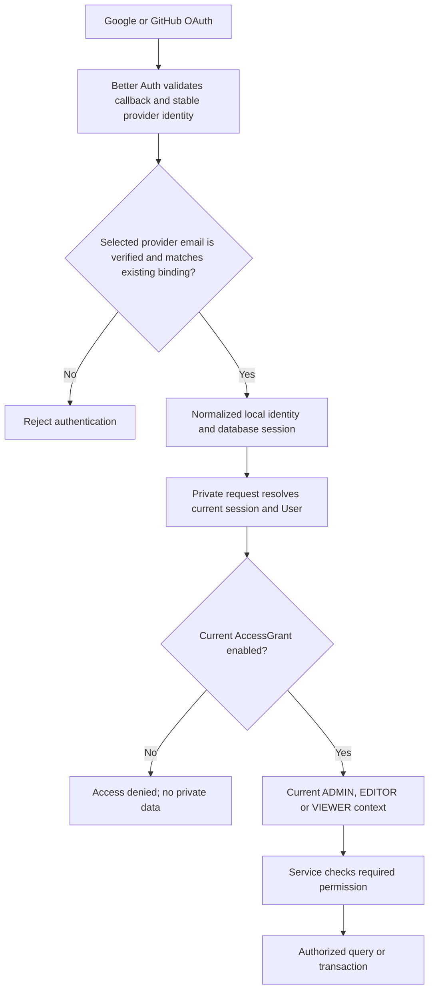

# GemuKore — Authentication Architecture Review

Task 3.1 · Reviewed 2026-10-04 · Design only; implementation begins in Task 3.2.

## 1. Recommendation and scope

Use Better Auth for Google/GitHub identity and PostgreSQL-backed sessions. Use the application-owned `AccessGrant` for all private permissions. An authenticated user without an enabled grant has no private collection access. A grant's current role, read on the server, is the only role authority.

This follows [PROJECT_SPEC.md §§10–12](../../PROJECT_SPEC.md), accepted decision A09 in [ARCHITECTURE_REVIEW.md](ARCHITECTURE_REVIEW.md), and the boundaries in [REPOSITORY_ARCHITECTURE.md](REPOSITORY_ARCHITECTURE.md). There is one collection and three roles; no membership framework, password login, auth administration plugin, Redis or separate auth service is needed.

The existing repository has no auth dependency, auth tables or protected product routes. This review specifies their future behavior; it does not claim that any security control is implemented or tested.

Public `/collection/...` requests use the public projection and publication gates regardless of whether the browser has an authenticated session.

## 2. Decisions for implementation

| Area                     | Final recommendation                                                                                                                  |
| ------------------------ | ------------------------------------------------------------------------------------------------------------------------------------- |
| Identity                 | Stable provider account ID plus a verified, normalized email. Email grants access; it does not replace the stable Account binding.    |
| Email normalization      | Trim surrounding whitespace and lowercase; validate the address. Use the same function at provider ingestion, grant setup and lookup. |
| Automatic linking        | Disabled. One OAuth provider binding per user for the MVP.                                                                            |
| Email changes            | No self-service email change or silent update on OAuth login. Controlled operator recovery only.                                      |
| Authorization            | Query the current enabled grant for every private operation; no role stored on User or Session.                                       |
| Sessions                 | Opaque database-backed session; fixed seven-day lifetime without sliding refresh; no session cookie cache.                            |
| Bootstrap                | Explicit local operator procedure creates the first enabled ADMIN grant before its holder logs in.                                    |
| Grant lifecycle          | Prefer disabling; deletion also removes access. Never cascade grant deletion into identity or collection records.                     |
| Last admin               | Ordinary application operations cannot remove the last enabled ADMIN. Serialize grant changes to protect this rule.                   |
| Sensitive administration | Require a session created within the previous five minutes for grant changes; ask the user to sign in again otherwise.                |
| Failure                  | Missing session, unverified identity, missing/disabled grant, invalid role or policy/database failure denies private access.          |

The fixed session lifetime and fresh-login requirement are project policy choices. They limit how long provider identity evidence remains usable without introducing provider API calls into every collection query.

## 3. Library version and schema compatibility

Research for this review checked the published `better-auth` **1.7.7** package, its matching core provider/callback code, official documentation and package peer requirements. Use that exact stable version for Task 3.2. Its declared compatibility includes the repository's Next.js 16, React 19 and Prisma 7 stack. The matching CLI package is **`auth` 1.7.7**, not the older `@better-auth/cli` package. The CLI requires Node 22.12 or later; this repository uses Node 24.20. [Published package metadata](https://registry.npmjs.org/better-auth/1.7.7), [CLI documentation](https://better-auth.com/docs/concepts/cli), [1.7 upgrade guide](https://better-auth.com/docs/guides/1-7-upgrade-guide).

Use the Prisma adapter for PostgreSQL and the existing lazy `getDatabase()` client/driver adapter. Do not create a second connection pool or replace Prisma 7's generator output/configuration with an example from another project. Generate the library schema using the pinned CLI into a temporary review file, then integrate the required models and run Prisma migrations. Do not run an auth-library database migrator alongside Prisma. [Prisma adapter guidance](https://better-auth.com/docs/adapters/prisma).

The library owns `User`, `Account`, `Session` and `Verification`. Its generated schema is authoritative for required fields; [DOMAIN_MODEL.md](DOMAIN_MODEL.md) describes responsibilities rather than an independently maintained adapter schema.

| Model        | Required architectural contract                                                                                                              |
| ------------ | -------------------------------------------------------------------------------------------------------------------------------------------- |
| User         | UUID ID, normalized unique email, emailVerified, library profile/timestamps. No authoritative application role.                              |
| Account      | UUID ID and User FK; opaque provider accountId and providerId; unique `(providerId, accountId)`; library token/expiry fields remain private. |
| Session      | UUID ID and User FK; opaque unique token, expiry and library fields. Index userId and expiry for session lookup/cleanup.                     |
| Verification | Library identifier/value/expiry contract. Identifier is opaque; do not force UUID or single-challenge uniqueness.                            |
| AccessGrant  | UUID ID, unique normalized email, role enum ADMIN/EDITOR/VIEWER, enabled, createdAt and updatedAt. No User FK; grants may precede login.     |

Use library-supported UUID generation and matching PostgreSQL UUID types for IDs and their foreign keys. Provider IDs, session tokens and verification identifiers are strings, not UUIDs. Add indexes for User foreign-key lookups; PostgreSQL does not create those automatically. `AccessGrant.enabled` should default to false, with explicit enabling; role has no permissive default.

Better Auth 1.7.7 retains `(providerId, accountId)` identity. The short-lived issuer-column change in early 1.7 releases was reverted; it is not a reason to alter the accepted domain model. [Upgrade guide](https://better-auth.com/docs/guides/1-7-upgrade-guide).

## 4. Verified email and provider identity

### Google

Keep Better Auth's redirect OAuth flow and built-in token validation. Use the stable Google subject as accountId and require the selected email's `email_verified` evidence. Request only the normal identity scopes. Disable the alternative ID-token sign-in endpoint for the MVP; do not add One Tap/native sign-in without applying the same identity guard. [Google integration](https://better-auth.com/docs/authentication/google).

### GitHub

GitHub's public profile can omit email. The built-in provider requests `read:user` and `user:email`, then consults the authenticated email endpoint. In the reviewed package, it chooses the profile email when present, otherwise the primary email or the library's fallback, and checks verification on that selected address.

Accept that deterministic selection only when its own verified flag is true. A different verified secondary address is not evidence for the selected address. Do not search for whichever alias happens to match an existing grant, substitute the username, or fabricate a noreply address. Missing email, failed provider lookup or unverified selected email denies authentication. [GitHub provider](https://better-auth.com/docs/authentication/github), [GitHub email endpoint](https://docs.github.com/en/rest/users/emails#list-email-addresses-for-the-authenticated-user).

### Guard returning logins as well as new users

`requireEmailVerification` alone is insufficient for this project: the reviewed callback checks stored User verification, which can survive a later provider-email change. A user-creation hook alone also misses returning logins. Keep `overrideUserInfoOnSignIn` false to prevent silent email rebinding. [OAuth options](https://better-auth.com/docs/concepts/oauth).

Place a small project identity guard at the validated provider user-info/callback boundary. Delegate OAuth exchange and provider verification to Better Auth; then require verified normalized email and compare it with the User attached to an existing `(providerId, accountId)`. Use a narrow server-side lookup for that comparison. On mismatch or loss of verification, reject the new login and revoke existing sessions for that binding when detected. Never transfer its grant, automatically update User.email, or force emailVerified to true.

Task 3.2 must prove that the pinned integration seam covers both first and returning logins before treating this guard as complete. Prefer wrapping the built-in provider user-info operation; if using a library hook instead, its exercised coverage must be equivalent. Do not replace the library's token validation with custom JWT decoding.

Normalize identically on persistence and lookup. Do not remove dots, strip `+suffix`, merge provider aliases, allow domain wildcards or apply fuzzy matching. The provider's selected verified address determines identity. An operator may provision that exact address; a typed address on a login form cannot provide verification.

Provider account changes are discovered on the next OAuth login, not continuously. Existing sessions remain usable until local revocation or the fixed expiry; this is the explicit maximum lifetime of accepted identity evidence. Current AccessGrant changes take effect independently on the next private operation.

## 5. Account linking, signup and recovery

Disable account linking, implicit same-email linking, trusted-provider shortcuts and different-email linking. Disable explicit link/unlink routes as well as hiding their UI: turning off implicit linking alone does not disable explicit linking. Do not enable self-service email change, password registration, credentials, anonymous login or the Better Auth Admin plugin. [Users and accounts](https://better-auth.com/docs/concepts/users-accounts).

A Google and GitHub account presenting the same email must not silently merge. The user signs in with the provider originally bound to their local User. Future linking needs a separate flow that proves control of both accounts through fresh authentication.

“No public account registration” means no public provisioning of application access. The accepted A09 design allows Better Auth to create identity/session records for a verified OAuth user whose email is not granted. That user reaches `/access-denied` and can sign out but cannot read private data. There is no signup form, automatic grant, first-login administrator, invitation system or registration role.

For changed email or a lost provider, use an explicit trusted operator recovery procedure: verify control of the replacement identity, provision its exact verified email grant, preserve User.id/actor history where rebinding is appropriate, revoke old sessions, and explicitly disable the old grant. Never make this a generic public endpoint or create an unverified identity as a shortcut. Record who performed recovery and what changed without recording tokens or secrets.

## 6. Session, cookie and request security

Configure a fixed seven-day session expiry with session refresh disabled. Disable cookie caching and request database-backed session validation for private context resolution. Role and enabled status never come from cookie/JWT snapshots. Request-local deduplication may be introduced for render reads later; mutation authorization must still re-read policy inside its transaction. [Session management](https://better-auth.com/docs/concepts/session-management).

Use host-only HttpOnly cookies, SameSite=Lax, Secure in production and no cross-subdomain sharing. Keep the library's OAuth state, CSRF and origin checks enabled. Use PKCE where the built-in provider supports it. Do not expose provider/session tokens in client DTOs, logs, URLs or local storage. Enable the library's OAuth access/refresh token encryption; protect the remaining database credentials and backups as private data too. No downstream provider API feature is needed for login. [Cookie guidance](https://better-auth.com/docs/concepts/cookies), [Security defaults](https://better-auth.com/docs/reference/security), [Configuration reference](https://better-auth.com/docs/reference/options).

Use a configured `BETTER_AUTH_URL` and exact trusted origins, rather than arbitrary request Host headers or wildcard origins. The Docker development browser origin is `http://localhost:3002`; its callback uses that external origin, not a container hostname. Configure a separate fixed origin when running Next.js locally. Production requires its actual HTTPS origin before provider setup.

Keep Better Auth's rate limiting enabled in production. In-memory limits are acceptable for the initial single-process deployment, with their restart/multiple-process limitation documented; no Redis is needed. Configure trusted proxy IP handling only for the actual deployment proxy. Direct server API calls do not automatically share HTTP endpoint rate limits, so do not expose an unchecked alternate login transport. Review abuse behavior in Task 3.6 and production operations. [Rate-limit behavior](https://better-auth.com/docs/concepts/rate-limit).

The auth route exports the library's Next.js GET/POST handlers. Session reads in Server Components use request headers; cookies are set through the auth route. Add the `nextCookies` plugin only if later Server Actions need auth operations that set cookies, following its required ordering. [Next.js integration](https://better-auth.com/docs/integrations/next).

## 7. Server authorization and module boundaries

Suggested files are introduced when needed, not scaffolded by this review:

| Area                                 | Responsibility                                                                                          |
| ------------------------------------ | ------------------------------------------------------------------------------------------------------- |
| `src/server/auth/`                   | Server-only Better Auth configuration, provider identity guard, session resolution and trusted context. |
| `src/features/auth/`                 | Client login controls, auth client and narrow transport/display contracts.                              |
| `src/app/api/auth/[...all]/route.ts` | Better Auth GET/POST integration exception to the usual feature route boundary.                         |
| `src/server/services/access/`        | Grant operations, bootstrap/recovery rules and last-admin protection.                                   |
| `src/server/repositories/access/`    | Narrow grant lookups/writes with the caller's transaction handle.                                       |
| `src/server/policies/`               | Pure role-to-permission checks; no cookies, database reads or provider calls.                           |

Do not put a client auth SDK and secret server configuration in shared `lib/auth.ts`. Shared components and `lib/` remain independent of feature and server modules under the Task 2.4 import rules.

Private context resolution must:

1. Resolve a current unexpired database session from the request, without trusting client-supplied IDs.
2. Load its User, require verified email, and normalize it with the shared identity rule.
3. Query the current unique AccessGrant; require enabled and a recognized role.
4. Return a server-only context containing userId, sessionId, grantId, normalized email and role.
5. At the service boundary, require the specific operation permission before querying or mutating private data.

The client may receive a selected display name, role label and UI capabilities. Those values help render controls; sending them back never authorizes a request. Services accept only trusted context produced by the server, not a structurally similar object assembled from action inputs.

Private layouts can redirect unauthenticated users to `/login` and denied users to `/access-denied` for navigation. Every private query, mutation, export, metadata loader and future media route still requires service authorization. A layout or middleware/proxy redirect does not secure directly callable Server Actions or route handlers. Use validated same-origin private return paths after login, never an arbitrary callback URL. [Next.js authorization guidance](https://nextjs.org/docs/app/guides/authentication).

Use private/no-store responses for private data, and no-store for auth/denial responses. Never persistently cache sessions, grants or authorized output across requests. Public readers always use dedicated public DTOs and publication checks; an ADMIN visiting the public URL does not receive extra private fields.

## 8. Roles and transactions

| Operation                                                    | ADMIN                     | EDITOR | VIEWER |
| ------------------------------------------------------------ | ------------------------- | ------ | ------ |
| Read private collection and select existing catalog entries  | Yes                       | Yes    | Yes    |
| Manage owned copies, contents, defects and locations         | Yes                       | Yes    | No     |
| Upload/manage personal collection media                      | Yes                       | Yes    | No     |
| Request enrichment candidates and prepare/review suggestions | Yes                       | Yes    | No     |
| Create/edit canonical records or accept canonical enrichment | Yes                       | No     | No     |
| Change application settings or publication/media approvals   | Yes                       | No     | No     |
| Manage access grants                                         | Yes, fresh login required | No     | No     |

Signing out of one's own session is available even without a grant. This table does not introduce unfinished domain endpoints; future features must apply these service permissions when implemented. Editor suggestion review does not imply canonical acceptance or public approval.

Mutating services recheck session identity and current enabled grant/role using the transaction before writes. Keep transactions short; provider network calls and enrichment generation happen outside them. Do not reuse a role captured during an earlier render or OAuth callback.

Revocation contract: once a grant disable/delete or role change commits, a subsequent private authorization check observes that policy. An operation already authorized before the change may finish; already delivered data cannot be recalled. This is request authorization, not continuous cancellation of in-flight work. Tests must distinguish those cases. If a future feature requires stronger serialization, introduce the necessary row locking for that use case rather than promising it through a session cache setting.

Grant administration must serialize all policy mutations with a PostgreSQL transaction-scoped advisory lock, then resolve the actor's current permission and validate the proposed final state. This prevents two concurrent administrators from each removing the other and leaving no enabled ADMIN. The ordinary web service rejects self/other changes that remove the final enabled ADMIN. Bootstrap/recovery uses the same serialization convention. This narrowly scoped lock avoids an extra lock table or distributed coordination service.

## 9. First administrator and recovery

Task 3.3 introduces an explicit local operator command, using the existing configuration/database helpers:

1. Take an email as explicit operator input; validate and normalize it. Never read a permanent bootstrap role override from a web request or public environment variable.
2. Open a short transaction and acquire the grant-management advisory lock.
3. Require that no enabled ADMIN exists. Create the specified enabled ADMIN grant, or recognize an exact existing enabled ADMIN as an idempotent no-op.
4. Refuse silent promotion/overwrite of an existing disabled or differently roled grant; use explicit recovery for that situation.
5. Commit and report the grant outcome without creating a User, password, fake verified identity or session.
6. The administrator signs in normally with the provider's matching verified email.

No HTTP bootstrap endpoint, “first OAuth user wins,” default grant or Better Auth `create-admin` command. The latter manages its own admin-plugin concept, not this application's AccessGrant.

An incorrect address or inaccessible last-admin account requires a trusted operator recovery action with the same transaction rules and an explicit record of the change. Recovery may restore access while the web application remains denied; the exception is operator authority, not a hidden authentication bypass. Prefer grant disabling over deletion to retain policy history; collect richer audit events when the project's audit facilities exist rather than adding another authentication entity now.

## 10. Findings and avoided failure modes

These are design risks found during review, not reported vulnerabilities in the current unauthenticated preview.

| Risk                                                 | Required resolution                                                                 |
| ---------------------------------------------------- | ----------------------------------------------------------------------------------- |
| OAuth callback treated as permission                 | Separate session identity from live grant authorization.                            |
| GitHub private/unverified email                      | Use the provider email endpoint and verify the selected address.                    |
| Stored emailVerified treated as fresh provider proof | Guard returning login identity before issuing a session.                            |
| Same-email provider account takeover/linking         | Disable implicit and explicit linking for the MVP.                                  |
| Silent provider email change redirects grants        | Reject mismatch; controlled recovery; revoke sessions when detected.                |
| Disabled user retains cached role                    | Disable session cookie caching; read current grant on private operations.           |
| Layout-only checks or hidden admin button            | Authorize each service read/write and direct transport entry.                       |
| Missing release created through an editor copy flow  | Separate canonical ADMIN operation from owned-copy CRUD.                            |
| Competing auth-library User.role                     | No Admin/organization plugin and no duplicate role column.                          |
| Concurrent removal of final ADMIN                    | Serialize grant changes and validate the resulting enabled-admin count.             |
| Auth DTO/token leak or public route gains privileges | Narrow server-to-client projection and separate public query contract.              |
| Adapter/version mismatch                             | Pin library/CLI together; generate and review schema against existing Prisma setup. |

Avoid adding session role synchronization, invitation entities, tenant memberships, custom OAuth token exchange, a generic policy engine or continuous provider polling. None is needed for the agreed hobby-project scope.

## 11. Handoff and verification gates

| Task                     | Deliverable and completion gate                                                                                                                                                                                                                                                                                                                                                                         |
| ------------------------ | ------------------------------------------------------------------------------------------------------------------------------------------------------------------------------------------------------------------------------------------------------------------------------------------------------------------------------------------------------------------------------------------------------- |
| 3.2 Better Auth          | Pin/install the reviewed library; integrate the four library models; Google/GitHub callbacks, verified-email guard, fixed sessions, logout and login/denial routes. Check first/returning login, private GitHub email, unverified/missing email, changed identity, blocked linking, callback/origin rejection, expiry and logout. Private product access remains denied until grant enforcement exists. |
| 3.3 AccessGrant          | App-owned schema, normalization, current-grant context, local bootstrap and operator recovery. Verify missing/disabled grants and role changes affect existing sessions on subsequent private operations.                                                                                                                                                                                               |
| 3.4 RBAC                 | Pure permission policy and service enforcement, last-admin transaction rules and fresh-login requirement for grant changes. Verify direct calls, editor canonical restrictions and concurrent administrator changes.                                                                                                                                                                                    |
| 3.5 Authentication tests | Expand unit, database integration and browser coverage for the complete identity → grant → service flow; do not replace meaningful earlier checks with fixtures that bypass auth.                                                                                                                                                                                                                       |
| 3.6 Security review      | Audit alternate endpoints, account/token/profile operations, CSRF/origins, session lifecycle, rate limits, private/public boundaries and logs; resolve findings before relying on the complete flow.                                                                                                                                                                                                    |

Task 3.2 must review the library endpoint surface and disable unused link/unlink, email-change, user-delete/profile identity-edit and token-export endpoints. Test forbidden endpoints directly; absence from the UI is insufficient. Keep ordinary own-session signout available.

Before real OAuth verification, supply the browser origin, Google/GitHub client IDs/secrets and server-only `BETTER_AUTH_SECRET`. Provider callbacks are `/api/auth/callback/google` and `/api/auth/callback/github` under the configured origin. These are operational inputs, not unresolved architecture choices. Add their validation and `.env.example` placeholders in Task 3.2; never commit values or use `NEXT_PUBLIC_*` for secrets. The first administrator's exact verified address is supplied when running Task 3.3's bootstrap.

This task checked repository/spec alignment, published compatibility, pinned provider/callback behavior and documentation consistency. It installed no dependency, generated no schema, changed no application route/configuration and ran no OAuth login. Runtime security and provider integration remain the implementation tasks' responsibility.
