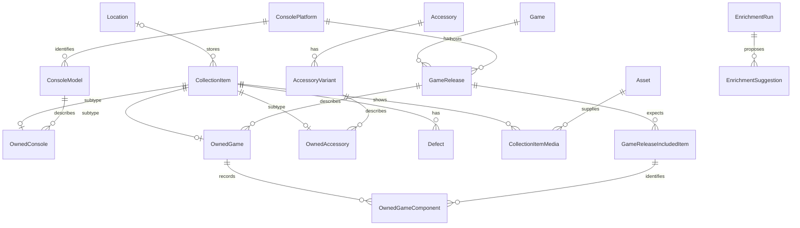

# GemuKore — Conceptual Domain Model

Task: **0.2 — Design the Domain Model**  
Date: **2026-09-29**  
Status: **Design deliverable complete; no Prisma schema, SQL migrations or application implementation.**

## 1. Authority, scope and decisions

This document develops [PROJECT_SPEC.md](../../PROJECT_SPEC.md), [DEVELOPMENT_PLAN.md](../../DEVELOPMENT_PLAN.md) and the [architecture review](ARCHITECTURE_REVIEW.md). The user accepted C01–C17 individually. Those decisions are fixed inputs, not alternatives to reconsider. The specification and plan have been reconciled with those decisions during this documentation task.

The detailed choices below are the architect's proposed domain design for implementation review. They are not presented as additional decisions individually approved by the user. Task 0.3's repository design is documented separately in [REPOSITORY_ARCHITECTURE.md](REPOSITORY_ARCHITECTURE.md). Task 4.1 must use the adopted core subset, not create every future-feature table listed here.

The model preserves:

- Global canonical catalog, separate from one shared physical collection.
- `ConsolePlatform → ConsoleModel`, `Game → GameRelease`, `Accessory → AccessoryVariant`.
- `CollectionItem` with exactly one matching owned subtype.
- Commercial markets independent of locking, language and video standard.
- Admin-only catalog writes; editors may manage copies and produce enrichment proposals.
- Explicit target foreign keys for shared reference/provenance records.
- Private originals, publication choices per item/media use and protected public asset delivery.
- Flat expected release components, separate actual presence, optional 3D templates and explicit artwork bindings.

### 1.1 Additional design choices made here

| Question left by the review | Proposed decision | Reason |
| --- | --- | --- |
| Exact subtype enforcement | Shared subtype primary key, fixed type and composite FK to the root; deferred constraint for required subtype existence. | Preserves specified composition and prevents inconsistent database states. |
| Unknown hardware identity | Admin may create a clearly incomplete model within a known platform; owned consoles still reference a real model row. | No fictitious region/model data and no parallel unlinked inventory. |
| Release identity | One game and platform; edition plus identifiable physical differences, identifiers and market links. No natural-key uniqueness on title/market/edition. | Two legitimate printings can share those labels. |
| Playtime scope | One optional set at Game; one optional release-specific override where the evidence applies to that release. | Broad estimates need not be copied into every boxed edition. |
| Default assets and personal overrides | Store them as roles on typed asset-use records; resolve existing spec “default/custom asset” fields as view properties. | One source of truth for roles, publication approval and ordering. |
| Defect severity | Retain the original four severity values initially; explicitly define COSMETIC as appearance-only. | Avoid expanding the condition taxonomy before it is useful. Category/impact separation remains a possible later refinement. |
| Unknown box state | Nullable `hasBox` initially; derive it from primary packaging presence once that release's component tracking is established. | Unknown is neither present nor absent; only one authoritative answer at a time. |
| Historical catalog corrections | Stable IDs, archive instead of destructive deletion when referenced, versioned edits and focused field history. | References and owned copies survive corrections without event sourcing. |
| Enrichment safety | One target per run, field suggestions, baseline revision checks and immutable accepted changes. | Prevents stale previews, accidental cross-entity edits and duplicate acceptance. |
| Financial/repair/multi-collection systems | No models now. | Explicit future scope; no speculative subsystem. |

These refine the specification's illustrative field lists. In particular, this design replaces singular catalog `regionId` fields with market links, `publisherId` with release-company credits, direct default/custom artwork pointers with asset-use roles, and release-level template pointers with component-level pointers. It retains `GameReleaseIncludedItem` as the name for the expanded component concept. The original `GameScreenshot` becomes a `CatalogAsset` role rather than a duplicate relationship table. These mappings are deliberate and must be carried into the eventual schema.

### 1.2 Main relationships

The three subtype relations are collectively exclusive and required: every item has exactly one, not zero or three. The diagram omits supporting market/credit/asset/slot relationships for readability; the tables below define their full cardinalities.

## 2. Shared relational conventions

### 2.1 Keys, optionality and ownership

- Standalone domain rows use UUID primary keys. Pure association tables may use composite primary keys, and owned subtypes reuse the root UUID. Configure authentication ID generation compatibly when integrating the selected Better Auth version.
- Every root/entity has `createdAt` and `updatedAt` unless described as immutable. Use timestamps with timezone for instants; a release date is a calendar date, not a timezone-dependent instant.
- Mutable catalog roots, owned-item aggregates and settings carry an integer `revision`, starting at 1 and incremented with each relevant transaction. Associated changes increment their owning aggregate's revision.
- Fields explicitly called optional/nullable may be unknown. Other identifying relationships are required. Unknown values are not stored as fake companies, regions, zero durations or fabricated dates.
- Catalog entities have optional stable `seedKey`, unique within their entity table, and optional `archivedAt`. Archiving hides a record from default creation selectors, not from existing owned-copy references. Names are not globally unique. Slugs are unique within their entity table and are not immutable identity.
- Catalog ownership means shared canonical knowledge managed by admins. Collection ownership means the shared collection, not the creator/uploader. Actor IDs record attribution only. There is no `ownerUserId`, `Collection` or `CollectionMember` in this release.
- Public detail routes use the item UUID as `[id]` for unambiguous copy identity, as defined in Task 0.3. Decorative title slugs are deferred. Catalog slugs cannot uniquely identify two copies of the same release.

### 2.2 Columns versus JSON

Use columns/FKs for names, identifiers, owners, relations, roles, statuses, publication controls, counts, dates, durations, scores, revisions and commonly filtered properties. Relationship membership never lives only in JSON.

Use validated JSON for sparse hardware specifications, bounded material/camera/UV settings, structured provider snapshots and immutable old/new field-value snapshots. Each JSON shape has a schema version and a service-side validator. An alias string list and language-code list may initially be validated scalar arrays/JSON because they are descriptive values rather than relationships to hidden entities. Do not add a language taxonomy merely to store those lists.

Dimensions use an explicitly documented unit (millimeters), weight uses grams, and playtime uses integer minutes. Partial release dates use `releaseYear`, optional `releaseMonth` and optional `releaseDay`: month requires year; day requires month and a valid calendar date. All null means unknown. Do not maintain an independent conflicting `releaseDate`; construct the display value from the available parts.

Technical locking is a nullable enum (`UNRESTRICTED`, `RESTRICTED`, `NOT_APPLICABLE`) plus an optional explanatory note. Null means unknown. Do not pretend this alone is a complete compatibility matrix.

### 2.3 Standard deletion and indexes

`RESTRICT` is the default for references to shared catalog roots, assets and retained audit targets. Deleting an owned root cascades its subtype and strictly dependent private rows, never canonical products or asset bytes. Creator/reviewer attribution may use `SET NULL` on account deletion; approval timestamps/decisions remain. User deletion does not delete collection data.

Each table below inherits its PK index and any unique-constraint indexes; additional indexes are candidates tied to actual queries. Index foreign-key lookup directions used for joins/deletion checks, but do not duplicate an index already covered by a useful leading composite key. PostgreSQL does not automatically create an index on the referencing side of a foreign key. [PostgreSQL constraints](https://www.postgresql.org/docs/current/ddl-constraints.html#DDL-CONSTRAINTS-FK).

Names can gain trigram indexes and descriptive text full-text indexes in Phase 7; boolean columns do not each need a standalone index. Small singleton/settings tables need no elaborate indexing. Use measured query plans before adding denormalized search documents, partial listing indexes or GIN indexes on entire JSON documents.

## 3. Identity and settings

### 3.1 Authentication entities

These are conceptual responsibilities, not a hand-written replacement for the authentication adapter schema. Better Auth defines User, Session, Account and Verification and supports schema generation for ORM adapters. Task 3.1/3.2 must validate the exact pinned-version requirements, compatible IDs and additional library fields. [Better Auth database documentation](https://better-auth.com/docs/concepts/database).

| Entity | Purpose and important fields | Relationships and ownership | Deletion | Uniqueness / likely indexes |
| --- | --- | --- | --- | --- |
| `User` | Authenticated identity: id, name, email, normalized verified-email identity, emailVerified, optional image, timestamps. No authoritative application role copied onto the user. | Auth-owned; 1:N sessions/accounts. Optional actor for edits/uploads. May have no grant and therefore no private access. | Removing a user deletes auth dependents, nulls actor links, preserves catalog/collection. | Adapter email uniqueness plus normalized-email policy; avoid two normalization rules. |
| `Session` | Library session credential, userId, expiry, library timestamps, optional IP/user-agent. | Exactly one User; many sessions per user. Entirely private. | Cascade with user; expiry/revocation cleanup. | Unique session token under adapter contract; userId and expiry lookup. |
| `Account` | Provider login binding: providerId, provider accountId, userId; optional token/expiry/scope fields required by integration. | Exactly one User; each provider identity belongs to at most one local user. | Cascade with user; logout/revoke provider credentials as appropriate. | Unique `(providerId, accountId)`; userId lookup. |
| `Verification` | Library-managed short-lived challenge/state: identifier, value, expiry and required timestamps. | Auth-owned; no catalog/collection relationship; user association only if the chosen adapter requires it. | Expiry cleanup according to library. | Library-required key semantics; identifier and expiry lookup. Do not invent single-challenge uniqueness that breaks the adapter. |
| `AccessGrant` | Authorized normalized email, role ADMIN/EDITOR/VIEWER, enabled, timestamps. | App-owned policy; exists before a User. Runtime matches verified normalized email, not an unverified client claim. | Prefer disable for revocation; deletion also immediately removes authorization. No cascade to user/content. | Unique normalized email. Primary lookup uses that key; no separate role index initially. |

Keep opaque provider credentials and session fields server-only. No public registration or OAuth callback can confer collection access without an enabled grant. Re-read current grant policy on private operations; session role snapshots are not the authority. Bootstrap the first grant using an explicit administrative setup procedure in Task 3.1. Account linking and verified-email changes remain authentication integration decisions, not extra catalog models.

### 3.2 Configuration entities

| Entity | Purpose and important fields | Relationships / ownership | Deletion | Uniqueness / indexes |
| --- | --- | --- | --- | --- |
| `AppSettings` | collectionName, collectionDescription, defaultTheme, timezone, optional preferredCurrency, revision, timestamps. Currency is unused in MVP behavior. | One application-owned singleton, admin-managed. Logo is an `AppAsset` use, not an ungoverned URL. | Singleton must remain; use update/reset, not ordinary delete. | Fixed singleton ID constrained to the sole allowed value. |
| `PublicSettings` | publicCollectionEnabled, allowSearchEngineIndexing, showSerialNumbers, showLocations, showNotes, showDefects, showPersonalPhotos; all false initially; revision, timestamps. | One admin-managed policy singleton. Sole owner of publication toggle. Additional item/use gates apply. | Singleton remains; disabling publication is an update. | Fixed singleton ID; no further indexes. |

No per-user collection ownership or generic settings key/value framework. A client can remember grid/list preference locally as specified. General settings do not automatically become public: public collection name/description are explicit selected fields gated by enabled publication.

## 4. Canonical catalog

### 4.1 Company and Region

| Entity | Purpose / important fields | Relations / cardinality | Ownership and deletion | Uniqueness / indexes |
| --- | --- | --- | --- | --- |
| `Company` | Reusable organization: name, slug, optional description, countryCode, foundedYear, website, aliases; shared root fields. | 1:N platform/model manufacturer links and accessory producer links; M:N game/release credits through explicit joins. Logo/gallery through CatalogAsset. | Canonical/admin. Restrict deletion while credited or referenced; archive when needed. | Unique slug/seedKey; normalized name search, no unique company-name assumption. |
| `Region` | Commercial market code and display name, optional description; shared root fields. Country and broad-market labels coexist without implicit geographic inference. | M:N models, releases and variants through distinct market tables. | Canonical/admin. Restrict while linked. | Unique immutable market code and slug; small table, no geography indexes. |

No Region Free row, TV-format row, or unknown sentinel. No market links means not identified. Worldwide is a deliberate market, not a fallback; prevent adding redundant Worldwide plus specific markets in the same product through validation. Country code on Company is not a FK to Region.

### 4.2 Consoles

| Entity | Purpose / important fields | Relations / cardinality | Ownership and deletion | Uniqueness / indexes |
| --- | --- | --- | --- | --- |
| `ConsolePlatform` | Console ecosystem: name, slug, optional manufacturerId, generation, originalReleaseYear, discontinuedYear, description/history, aliases; shared root fields. | 1:N models and releases; M:N variants through compatibility. Primary manufacturer may be unknown. | Canonical/admin. Restrict if models/releases/compatibility/retained history reference it. | Unique slug/seedKey; name search; manufacturerId. |
| `ConsoleModel` | Concrete hardware configuration: platformId, name, slug, optional modelNumber, manufacturerId, releaseYear, discontinuedYear, identificationStatus INCOMPLETE/CONFIRMED, specifications JSON, dimensions, weight, locking fields. | Exactly one platform; 0:N markets/product identifiers/assets; 0:N owned consoles. Manufacturer is explicit actual maker if known, not an automatically persisted copy of platform manufacturer. | Canonical/admin. Restrict if owned or otherwise referenced; archive. | Unique slug/seedKey. Index platformId, manufacturerId, modelNumber for lookup. Model numbers are not globally unique. |
| `ConsoleModelRegion` | Declares a model's known markets: consoleModelId, regionId. | Join; each row connects exactly one of each. | Catalog dependent. Deleting model removes its market joins if root deletion is otherwise permitted; deleting region is restricted. | Composite PK `(consoleModelId, regionId)`; reverse `(regionId, consoleModelId)` for region filtering. |

Platform/model distinction is not a promise of universal compatibility. Backward compatibility, add-on chains and emulation graphs are deferred. Regional aliases such as Genesis/Mega Drive can identify one ecosystem; distinct electrical or physical revisions identify separate models. Display primary brand and actual manufacturer separately when they differ.

An incomplete “unidentified revision” model may be used within a known platform and later replaced on a copy after identification. Its incompleteness must be visible. Do not merge two confirmed configurations simply because their display names match.

### 4.3 Games and releases

| Entity | Purpose / important fields | Relations / cardinality | Ownership and deletion | Uniqueness / indexes |
| --- | --- | --- | --- | --- |
| `Game` | Conceptual game: name, slug, optional description, aliases, sourced rating group, structured trailer group; shared root fields. | 1:N releases; M:N company credits; optional playtime default; assets/references. A compilation can be its own Game initially. | Canonical/admin. Restrict if releases or retained references/history exist. | Unique slug/seedKey; name search. No global title uniqueness. |
| `GameRelease` | One physical commercial release: gameId, platformId, slug, editionName/type, optional printingLabel, identificationStatus, languages, locking fields, description override, sourced rating/trailer overrides, metadata. | Exactly one game/platform; 0:N market/date links, release-company credits, product identifiers, expected components and assets; 0:N owned copies; optional playtime override. | Canonical/admin. Restrict if copies/components/history/reference rows exist. | Unique slug/seedKey; `(gameId, platformId)`, platformId and editionType as query needs dictate. Never unique solely by game/platform/market/edition. |
| `GameReleaseRegion` | One release's market and optional launch date parts. | Exactly one release and region per row. A release has zero or more; date varies by market. | Catalog dependent; cascade if release can be deleted, restrict region deletion. | Composite PK `(gameReleaseId, regionId)`; reverse region/release index; releaseYear only if useful for filtering. |
| `GameCompany` | General development credits: gameId, companyId, role (initially DEVELOPER), optional creditLabel, sortOrder. | Explicit M:N association, no polymorphic company-role target. | Cascade with deletable Game; restrict referenced Company. | Composite unique `(gameId, companyId, role)`; reverse companyId lookup. |
| `GameReleaseCompany` | Release-specific developer/port developer/publisher/distributor credits, optional regionId, creditLabel and sortOrder. | Exactly one release/company per role assignment; multiple publishers allowed. Optional market scope must reference that release's GameReleaseRegion through a composite FK. | Cascade with deletable release; restrict Company and referenced market association. | Unique release/company/role for unscoped credits; unique release/company/role/region for scoped credits, using separate partial indexes. Reverse company/role/release index if publisher filtering needs it. |
| `GamePlaytime` | mainMinutes, mainExtrasMinutes, completionistMinutes (nullable nonnegative integers), sourceType MANUAL/PROVIDER, sourceName, optional sourceUrl, observedAt, timestamps. | Exactly one populated Game or GameRelease FK; at most one row per game and per release. | Catalog/admin. Cascade with its deletable target. Root revision and history govern edits. | Separate unique populated gameId and gameReleaseId indexes plus exactly-one-target check. No competing active source sets. |

Game-level metadata is the default. A release-specific override is used only when evidence supports that scope. Do not create a third “GamePlatformVersion” entity yet. If an estimate applies to a specific port, attach it to the relevant release, label it accordingly, and do not automatically copy it to unrelated editions. A release playtime set replaces the entire default set in display; missing values in that set remain unknown, so different sources are not silently mixed.

Date summary is the earliest known market date at its available precision. If only a release year is known without its market, store optional `firstReleaseYear` on GameRelease as a labeled fallback, not as a second exact date. A year-only estimate must not be ordered as if January 1 were a known launch day. Task 7.1 defines date sort rules and null ordering explicitly.

Rating group: optional value, maximum, source name/URL and observedAt; value and positive maximum are required together, with value between zero and maximum. It represents one sourced review/community score, not a personal rating or age certification. Game and release may use the group with documented whole-group fallback. Do not mix scales without explicit normalization or treat missing scores as zero.

Trailer group: optional provider (`YOUTUBE` or `DIRECT_URL`), provider ID or validated URL as appropriate, publicApproved (default false) and optional reviewer/reviewedAt. It contains no iframe HTML. It is a reviewed external reference for display, not an Asset containing nonexistent local bytes. Replacement clears approval. When storing uploaded video instead, use the asset-use roles below. External provider visibility does not itself approve embedding.

An ordinary port may share Game identity. A materially distinct remake is a separate Game. Remaster/compilation edge cases follow a documented admin curation decision; no automatic provider merge and no title-based uniqueness. Collection counts count owned copies, not the number of titles inside compilations.

### 4.4 Accessories

| Entity | Purpose / important fields | Relations / cardinality | Ownership and deletion | Uniqueness / indexes |
| --- | --- | --- | --- | --- |
| `Accessory` | Product family: name, slug, optional producerId, description, releaseYear, specifications JSON, rating/trailer groups; shared root fields. | 1:N variants; assets and references. Compatibility shown on family views is a labeled union of variant relations. | Canonical/admin. Restrict while variants or retained references/history exist. | Unique slug/seedKey; name search; producerId. |
| `AccessoryVariant` | Concrete version: accessoryId, name, slug, optional modelNumber, producerId, color, edition, releaseYear, description override, specifications override JSON, trailer override, locking fields and identificationStatus. | Exactly one family; 0:N markets, compatibility links, identifiers/assets; 0:N owned accessories. | Canonical/admin. Restrict when owned/referenced; archive. | Unique slug/seedKey; accessoryId, modelNumber and producerId lookups as needed. Variant name/color alone is not identity. |
| `AccessoryVariantRegion` | variantId, regionId. | Explicit M:N commercial markets. | Cascade with deletable variant; restrict Region. | Composite PK and reverse region/variant index. |
| `AccessoryVariantPlatform` | variantId, platformId, optional compatibilityNote. | Explicit M:N confirmed platform compatibility; no family-level authoritative list. | Cascade with deletable variant; restrict Platform. | Composite PK `(variantId, platformId)`; reverse `(platformId, variantId)` for collection filters. |

Variant overrides replace a whole shared field/group; absent override means use the family value. For specifications, start with whole-object replacement rather than an implicit deep merge. Clearly label variant-specific information. One named standard variant is valid. Copying a compatibility list during creation is a reviewed initial value, not an ongoing dependency on its source variant. Model-specific restrictions/adapter requirements remain explanatory notes; lack of a link means unconfirmed, not proven incompatible.

### 4.5 Identifiers and external references

| Entity | Purpose / important fields | Relations / cardinality | Ownership and deletion | Uniqueness / indexes |
| --- | --- | --- | --- | --- |
| `ProductIdentifier` | scheme (PRODUCT_CODE/UPC/EAN/OTHER), value as text, normalizedValue, optional issuer/market note. | Exactly one nonnull FK: consoleModelId, gameReleaseId or accessoryVariantId. Target may have many identifiers. | Canonical/admin; cascade only with a deletable target. | Unique `(target, scheme, normalizedValue)` using per-target unique indexes. Index `(scheme, normalizedValue)` for lookup, but do not require global uniqueness: codes can span printings. |
| `ExternalReference` | provider, providerObjectType, externalId (optional for URL-only sources), url, bounded metadata, timestamps. | Exactly one target FK among company, platform, model, game, release, accessory, variant. Each target may have many references. | Canonical/admin; target deletion restricted until references are deliberately removed/reassigned. | Per-target uniqueness of known `(provider, providerObjectType, externalId)` or normalized URL when no external ID. Lookup index on provider/type/id; no universal external-ID uniqueness across every target. |

For target-keyed uniqueness, “target” is shorthand for explicit per-target constraints, not a literal unchecked target column. Reject empty references with neither external ID nor URL. Multiple physical releases may use the same broad source; provider identity is not assumed to establish physical edition identity. Match broad game IDs to Game where possible. Leading zeros in product codes are significant; never use numeric columns for them. Primary model numbers stay on Model/Variant; ProductIdentifier stores additional commercial identifiers rather than duplicating that field. Search can query both sources.

## 5. Owned collection

### 5.1 Item and subtypes

| Entity | Purpose / important fields | Relations / cardinality | Ownership and deletion | Uniqueness / indexes |
| --- | --- | --- | --- | --- |
| `CollectionItem` | One owned copy/set: type CONSOLE/GAME/ACCESSORY, optional serialNumber, observedMarkings, locationId, nullable hasBox, private notes, publicationStatus PRIVATE/PUBLISHED (default PRIVATE), optional publishedAt/publishedById, revision, actor IDs, timestamps. | Exactly one matching subtype; optional one location; 0:N defects/media. No per-user owner and no stock quantity. | Shared collection. Root deletion cascades subtype, defects, media links and owned component presence; never assets or catalog. | PK id; candidate unique `(id,type)` for subtype FKs; `(createdAt,id)`, `(type,createdAt,id)`, locationId. Serial lookup as needed, never global unique. |
| `OwnedConsole` | collectionItemId PK, fixed type CONSOLE, consoleModelId. | Exactly one root and one model. Canonical markets are resolved through model; no region override. Personal logos/models use media roles. | Root dependent. Cascade with root; restrict model deletion. | PK plus modelId index; composite FK root/type. |
| `OwnedGame` | collectionItemId PK, fixed type GAME, gameReleaseId. | Exactly one root/release; 0:N component-presence rows. | Root dependent. Cascade with root; restrict release deletion. | PK; gameReleaseId; candidate unique `(collectionItemId, gameReleaseId)` for presence consistency. |
| `OwnedAccessory` | collectionItemId PK, fixed type ACCESSORY, accessoryVariantId. | Exactly one root/variant; custom display model through personal media. | Root dependent. Cascade with root; restrict variant deletion. | PK; accessoryVariantId; composite FK root/type. |

All three subtypes use matching fixed type checks and a composite FK to `(CollectionItem.id, CollectionItem.type)`. This prevents an item of one type from having another type's child; child PKs prevent multiple matching children. A deferred constraint trigger checks that each surviving root has its matching subtype at transaction end. Attach checks to root creation and relevant subtype deletion/update; deleting the root is valid and skipped after cascade. Root type is immutable. Transactions and row locking protect aggregate edits; no HTTP/provider/object-store calls occur while holding those locks.

A row-local CHECK cannot prove another table contains a child. Deferred constraint triggers are a deliberate PostgreSQL migration responsibility; ordinary FK/check/unique constraints should do all remaining enforcement possible. Task 4.2 must verify direct database writes, not just service behavior. [PostgreSQL CHECK limits](https://www.postgresql.org/docs/current/ddl-constraints.html#DDL-CONSTRAINTS-CHECK-CONSTRAINTS), [constraint-trigger timing](https://www.postgresql.org/docs/current/sql-createtrigger.html).

Re-identifying a copy changes its model/release/variant under authorization and revision checks, not its category. An OwnedGame release reassignment must explicitly reconcile or clear owned component mappings; it cannot leave components linked to the previous release. Multiple copies of one release are valid and counted separately.

### 5.2 Locations and defects

| Entity | Purpose / important fields | Relations / cardinality | Ownership and deletion | Uniqueness / indexes |
| --- | --- | --- | --- | --- |
| `Location` | name, normalizedName, nullable parentId, type PROPERTY/ROOM/FURNITURE/SHELF/CONTAINER/CUSTOM, optional description, sortOrder, timestamps. | Adjacency-list tree; optional parent, 0:N children and items. | Shared collection, editor/admin management. Restrict deletion if children or items remain. | Sibling normalized-name uniqueness; separate unique root-name rule for null parent. Index parentId with sortOrder/id. |
| `Defect` | collectionItemId, title, optional description, severity COSMETIC/MINOR/MAJOR/CRITICAL, status ACTIVE/REPAIRED/ACCEPTED, optional resolvedAt/repairNote; later optional ownedComponentId. | Exactly one item; optional component must belong to that same item. Media evidence can remain ordinary item media initially. | Shared collection; cascade with root. Component deletion restricted while specifically referenced; detach explicitly if appropriate. | `(collectionItemId,status)`; no independent global severity index without a query need. |

Location names are trimmed and normalized consistently for sibling checks; separate partial uniqueness for roots avoids null-parent duplicates. Type is descriptive, not a rigid nesting law. An item with no location is unassigned. Serialize hierarchy mutations with a transaction-scoped lock for this single small tree, then validate ancestors; this prevents two concurrent valid-looking moves creating a cycle. A row-level self-parent check is additional protection, not a complete cycle check. No closure table or stored breadcrumb path.

COSMETIC means appearance-only; MINOR/MAJOR/CRITICAL represent increasing impact. This intentionally retains the specified enum instead of adding a second categorization system now. ACCEPTED is acknowledged but unresolved. Unresolved counts include ACTIVE and ACCEPTED; “active” counts mean ACTIVE only and must be labeled accordingly. REPAIRED requires a resolution timestamp and preserves history. Unknown condition is not “no defects confirmed.” Missing release contents use component presence; avoid duplicating an absent manual as a defect unless separate fault documentation is useful.

All personal fields are private unless the public policy explicitly permits them. Publishing an item does not implicitly expose its notes, serial or location. Publication changes and associated media approvals are ADMIN-only, even though EDITOR may edit ordinary copy data.

If an editor changes copy data that contributes to its currently public projection, reset the item's publication status to PRIVATE for admin review. Changes confined to private fields do not unpublish it. Media-use changes follow their own approval-reset rule below. These rules prevent a previous publication approval from silently authorizing replacement content.

## 6. Assets, uses and provenance

### 6.1 Stored assets

| Entity | Purpose / important fields | Relations / cardinality | Ownership and deletion | Uniqueness / indexes |
| --- | --- | --- | --- | --- |
| `Asset` | File identity: kind IMAGE/MODEL_3D/VIDEO/DOCUMENT/OTHER; storageNamespace, immutable objectKey, MIME type, sizeBytes, optional dimensions/duration, originalFilename, sha256. Scope CATALOG/COLLECTION; deliveryClass ORIGINAL/DISPLAY; state PENDING/READY/FAILED/DELETING. SourceType, provider/source URL, author, license/attribution/restrictions, retrievedAt; rightsStatus UNKNOWN/APPROVED/RESTRICTED, publicSafe default false, optional reviewer/reviewedAt; transform metadata, actor/timestamps. | Reused by many catalog/item/application uses, templates and bindings. May derive from several input assets through dependencies. Uploader is attribution, not collection owner. | Storage subsystem owns bytes. Referenced rows cannot be deleted. Cleanup deletes bytes only after all references are gone and pending/deletion policy permits it. Actor deletion never deletes an asset. | Unique `(storageNamespace,objectKey)`; nonunique sha256; `(state,createdAt)` for cleanup; uploader lookup if needed. |
| `AssetDependency` | derivedAssetId, sourceAssetId, purpose such as RESIZE/SANITIZE/RENDER_INPUT. Records provenance, not an automatic publication grant. | Directed N:M input lineage; one thumbnail has one input, a rendered package preview may have geometry and several texture inputs. | Asset lifecycle-owned. Restrict input deletion while referenced; deleting an unreferenced derived output cascades its dependency edges only. | Composite PK `(derivedAssetId,sourceAssetId)`; reverse source/derived index. No self edge. |

Provenance is structured wherever it controls behavior; miscellaneous imported metadata may be bounded JSON. Unknown rights block public distribution. `publicSafe` means these exact bytes have passed content/public-display review; it is not the item's publication choice and does not replace rights review.

Derivation must preserve applicable rights restrictions. A sanitized derivative can become public-safe while its original remains private; do **not** require the private original's publicSafe flag to become true. Require rights approval for the relevant input lineage and content approval for the actual displayed bytes. An original remains ineligible for direct public delivery because its deliveryClass is ORIGINAL. A 3D viewer separately checks every geometry/texture it actually delivers. This distinguishes provenance dependencies from runtime-public assets.

Dependencies are fixed before finalizing an output. New outputs may reference existing READY inputs; input dependencies cannot be rewritten later to create a cycle. Transformations create a new asset/key, not replacement bytes under an approved ID. A checksum match permits a duplicate warning or carefully scoped reuse, never permission inheritance.

State flow is PENDING → READY or FAILED; unreferenced rows may enter DELETING. The upload service validates content/resource limits and finalizes metadata before READY. DB writes and object-store writes are separate failure domains: failed completion is retryable, deletion is retryable, and orphan reconciliation is an explicit operation. Never mark a referenced asset DELETING. Serialize final reference attachment versus cleanup using asset-row checks/locks so a ready asset cannot be attached after cleanup has claimed it.

MinIO and the chosen production service share one configurable S3-compatible adapter. URLs and credentials are not stored as permanent public access authority. Initial 3D ingestion is self-contained GLB only. Image derivatives strip EXIF/GPS and identifying filenames; reviewing pixels is still necessary. No worker/queue is introduced for these contracts.

### 6.2 Asset usage records

All uses have an assetId for private/default display, optional publicDisplayAssetId, publicApproved (false initially), optional approvedById/approvedAt, and relevant captions/alt text. A public display asset must be READY, DISPLAY-class, rights-approved and public-safe. It may equal assetId if that asset already satisfies those conditions; it can never expose an ORIGINAL-class object. If it differs, its provenance must justify the relationship rather than substituting an unrelated image unnoticed.

| Entity | Purpose / important fields | Relations / cardinality | Ownership and deletion | Uniqueness / indexes |
| --- | --- | --- | --- | --- |
| `CatalogAsset` | role LOGO/COVER/SCREENSHOT/GALLERY/MODEL_3D/VIDEO/PREVIEW, isPrimary, caption, altText, sortOrder and approval fields. | Exactly one target among Company, ConsolePlatform, ConsoleModel, Game, GameRelease, Accessory, AccessoryVariant or GameReleaseIncludedItem. One target has many uses. Asset may be used by many targets. | Canonical/admin. Cascade links with a deletable owner; referenced Asset deletion restricted. No bytes cascade. | At most one primary per target/role via per-target partial unique indexes; target/role/order lookup; both asset FK lookups. |
| `CollectionItemMedia` | type PHOTO/FRONT/BACK/LEFT/RIGHT/TOP/BOTTOM/SERIAL/BOX/DAMAGE/OTHER plus CUSTOM_LOGO/CUSTOM_MODEL roles; caption, altText, sortOrder, isPrimary, approval fields. | Exactly one CollectionItem; 0:N uses per item. Custom logo valid for console; custom model for console/accessory initially. | Shared collection; editors manage private uses, admins approve public uses. Cascade link with item, restrict referenced assets. | `(collectionItemId,sortOrder,id)`, asset FK indexes; partial uniqueness of primary custom role per item. Duplicate order values use id as a stable tie-break. |
| `AppAsset` | Application display role (initially COLLECTION_LOGO), asset links and approval fields. | Exactly one AppSettings singleton and one private/default Asset; optional public display version. | App/admin. Remove link explicitly; asset deletion restricted while linked. | Unique `(appSettingsId,role)` and asset FK lookups. |

Catalog defaults such as Company.logoAssetId or ConsoleModel.default3DModelAssetId are **resolved properties**, not additional independently editable foreign keys in this proposed schema. Primary CatalogAsset roles supply them. Likewise, OwnedConsole.customLogoAssetId and owned custom-model properties resolve from CollectionItemMedia custom roles. This slightly different physical schema preserves the required product behavior while giving every displayed use explicit approval and ownership.

Console-model display can fall back to platform imagery; accessory variants can fall back to family imagery; game releases can fall back to game imagery. Mark inherited assets in DTOs. Public resolution independently chooses eligible uses at each level, never starts with a private resolved object and strips fields afterward. Ineligible personal override → eligible canonical fallback → neutral placeholder.

Replacing an approved image, publicDisplayAssetId, caption or other publicly visible use content resets approval. Editors cannot retain an old approval while substituting private content. A separate admin action explicitly reapproves the changed use. SERIAL-classified media and private originals are excluded by default. Asset rights/content revocation blocks every affected use even if an old approval flag remains true.

### 6.3 Publication rule

Public collection output requires the global toggle. Item output additionally requires PUBLISHED status. Field output additionally obeys the corresponding settings. Personal media requires showPersonalPhotos plus approved use and eligible display asset. A personal custom model/logo counts as personal media for this gate. Canonical fallback still needs an approved catalog use and eligible asset.

For generated package/media viewers, publish only approved component presentations whose base geometry and every delivered texture pass eligibility checks. A derived preview must pass its own content review and input-rights checks. Do not infer public permission from “this URL exists” or “this model is from the catalog.”

Public asset endpoints resolve access through the permitted item/use/component context. Knowing an object key or Asset ID is insufficient. Task 0.3 defines authorized streaming, current-policy checks and no-store responses as the baseline in [REPOSITORY_ARCHITECTURE.md](REPOSITORY_ARCHITECTURE.md). Requests evaluated after a committed revocation must fail the applicable gate; an in-flight response or already downloaded file cannot be recalled. Any later signed-read or shared-cache policy requires an explicit access lifetime and revocation design.

Public search uses only permitted fields and published rows, including filters/counts/suggestions. The public query must not match private notes or serials and then return a sanitized card. Account records, audit payloads, provider snapshots, raw metadata, source filenames and storage keys are excluded from public DTOs.

## 7. Physical edition components and templates

These are designed now and introduced with their feature phases. The flat domain can describe a component without rendering it.

### 7.1 Expected and actual contents

| Entity | Purpose / important fields | Relations / cardinality | Ownership and deletion | Uniqueness / indexes |
| --- | --- | --- | --- | --- |
| `GameReleaseIncludedItem` | Expected component: gameReleaseId, name, kind PACKAGING/MEDIA/MANUAL/EXTRA, quantity > 0, description, sortOrder, isPrimaryPackage default false, optional packagingTemplateId or physicalMediaTemplateId, presentationApproved default false with reviewer/time. | Exactly one release; optional one appropriate template; 0:N artwork bindings and catalog assets. A release has many components. | Canonical/admin; restrict deletion if owned presence refers to it; changes remain in release-level historical snapshots. Cascade permitted dependents only when component deletion is allowed. | Candidate unique `(id,gameReleaseId)` and `(id,templateId)` as needed for composite FKs; one primary package per release (partial unique); release/order index. |
| `OwnedGameComponent` | Actual presence: id, collectionItemId, gameReleaseId, includedItemId, nullable presentQuantity, optional private note, timestamps. | Exactly one OwnedGame and expected component from the **same release**. At most one row per copy/component. | Shared collection, editor/admin. Cascade with owned root; restrict catalog component deletion. | Unique `(collectionItemId,includedItemId)`; candidate unique `(id,collectionItemId)` for defect FK; composite FKs to OwnedGame and IncludedItem using gameReleaseId; includedItemId reverse lookup. |

The two template FKs on a component are optional and exclusive. A PACKAGING component may use only a PackagingTemplate; a MEDIA component may use only a PhysicalMediaTemplate. MANUAL/EXTRA initially have neither. isPrimaryPackage requires PACKAGING and quantity = 1. No nested components, independent component locations or per-component acquisition history. The optional Defect-to-OwnedGameComponent relationship uses deferred no-action checking so root deletion can cascade both rows in one transaction; deleting a referenced component alone still requires explicit defect reassignment/detachment.

Missing OwnedGameComponent row or null quantity means unknown. Zero means confirmed absent; positive quantity means present count. Quantities are nonnegative; more than expected is allowed and labeled as surplus, not silently truncated. Catalog expected-quantity corrections must not erase observed counts. A named Disc 1 and Disc 2 are separate rows because their identities/artwork differ; quantity is for interchangeable repeated pieces.

Before component tracking, CollectionItem.hasBox is nullable manual data. Once a release has a designated primary package, effective hasBox comes from that package's owned presence (unknown/absent/present). The stored legacy field is no longer independently editable. Introducing a primary package requires a deliberate migration of known legacy answers to presence rows (true → 1, false → 0, null → unknown). Reassigning the primary package must explicitly reconcile existing presence rather than silently changing the meaning of hasBox.

When a copy switches release, component mappings are reconciled in the same transaction. Composite FKs reject mappings across releases even if application validation is bypassed. Completeness is derived from expected versus actual quantities; do not store an independent “complete” flag that can disagree. All components share their copy's location. Box-only acquisitions and cross-category hardware bundles remain later product scope.

### 7.2 Template records

| Entity | Purpose / important fields | Relations / cardinality | Ownership and deletion | Uniqueness / indexes |
| --- | --- | --- | --- | --- |
| `PackagingTemplate` | Reusable geometry contract: name, slug, familyKey, revisionNumber, geometryType PROCEDURAL_BOX/GLB, optional baseModelAssetId, dimensions in mm, materialSettings/cameraSettings/metadata JSON, status DRAFT/READY, timestamps. | 1:N PackagingTextureSlots; reused by many packaging components. GLB uses one Asset; procedural box requires dimensions rather than a file. | Canonical/admin. Restrict deletion while components reference it; referenced contract revisions immutable. Asset deletion restricted while referenced. | Unique slug and `(familyKey,revisionNumber)`; baseModelAssetId lookup. |
| `PackagingTextureSlot` | packagingTemplateId, name, required, materialName/UV mapping settings and bounded metadata. | Exactly one template; reused by bindings on components choosing that template. | Template dependent; delete with unreferenced/deletable template, otherwise restrict if bound. | Unique `(packagingTemplateId,name)`; candidate `(id,packagingTemplateId)` for binding consistency. |
| `PhysicalMediaTemplate` | name, slug, familyKey, revisionNumber, type CARTRIDGE/DISC/CARD/OTHER, baseModelAssetId (nullable for drafts, required when READY), dimensions, material/camera settings, metadata, status DRAFT/READY, timestamps. | 1:N PhysicalMediaTextureSlots; reused by many media components. Initially GLB-based. | Canonical/admin. Same reference/immutability rules as packaging. | Unique slug and `(familyKey,revisionNumber)`; baseModelAssetId lookup. |
| `PhysicalMediaTextureSlot` | physicalMediaTemplateId, name, required, materialName/UV settings, metadata. | Exactly one media template; 0:N bindings. | Template dependent, same deletion restrictions as packaging slots. | Unique `(physicalMediaTemplateId,name)`; candidate `(id,physicalMediaTemplateId)`. |

A READY GLB template requires a validated READY model asset. Drafts can be incomplete; drafts are not rendered publicly. Procedural dimensions must be positive. Slot names such as FRONT/BACK/SPINE and DISC_ART are template-local keys, not one global enum requiring every template to support every face.

Once in use, changing geometry, material names or UV contracts creates another template revision row. Camera-only presentation adjustments can remain mutable within a validated contract. FamilyKey is a lightweight grouping value, not an extra template-family entity. The template may be reused across platforms; its dimensions and slot contract determine suitability, not the platform name alone.

### 7.3 Artwork bindings

| Entity | Purpose / important fields | Relations / cardinality | Ownership and deletion | Uniqueness / indexes |
| --- | --- | --- | --- | --- |
| `PackagingTextureBinding` | includedItemId, packagingTemplateId, packagingTextureSlotId, assetId, optional crop/UV transform JSON. | One component and one slot from its chosen template, with one artwork asset. | Canonical/admin. Cascade when a deletable component is removed; template/slot/asset referenced deletion restricted. | Unique `(includedItemId,packagingTextureSlotId)`; composite FKs ensure same template on component and slot; assetId reverse index. |
| `PhysicalMediaTextureBinding` | includedItemId, physicalMediaTemplateId, physicalMediaTextureSlotId, assetId, optional transform JSON. | Same relationship for a media component. | Same rules as packaging binding. | Unique `(includedItemId,physicalMediaTextureSlotId)`; composite template consistency FKs; assetId reverse index. |

Binding assets used publicly must be display-class/public-safe/rights-approved; originals are not sent to the browser as textures. Changing the template, bindings or renderer-visible metadata invalidates component presentation approval. Public template geometry receives the same asset checks. A required slot means “required for a complete rendering,” not “required to save a catalog release.” Missing artwork yields a neutral surface or static fallback; it is never invented. A cover photo is not automatically a correctly laid-out box texture.

No `GameRelease.packagingTemplateId` or `physicalMediaTemplateId` remains as an independent source of truth. UI shortcuts can select the primary package/media component, but the component is the actual owner of its template and textures.

## 8. Enrichment and metadata history

### 8.1 Provenance and workflow entities

| Entity | Purpose / important fields | Relations / cardinality | Ownership and deletion | Uniqueness / indexes |
| --- | --- | --- | --- | --- |
| `MetadataChange` | Immutable field change: fieldPath, before/after typed JSON snapshots, rootRevision, origin MANUAL/SEED/PROVIDER/AI_ASSISTED, optional sourceSnapshot, actorId, createdAt; later optional enrichmentSuggestionId. | Exactly one canonical target FK among Company, Region, Platform, Model, Game, Release, Accessory or Variant. Child edits record paths under their canonical root. At most one applied change per suggestion. | Private audit, server-written with canonical mutation. Target deletion restricted while retained; actor may be nulled. No public endpoint. | Per-target `(targetId,rootRevision,fieldPath)` unique; target/time indexes; unique nonnull suggestionId when Phase 13 adds it. |
| `EnrichmentRun` | One retrieval attempt: explicit target FK, requestedById, requestKey, query JSON, provider identity, candidate/result snapshots, fetchStatus PENDING/RUNNING/NEEDS_SELECTION/COMPLETED/FAILED, targetBaseRevision, start/completion times and redacted error. | Exactly one Game/GameRelease/Accessory/AccessoryVariant. One run has 0:N suggestions; same target can have many runs. | Private workflow; editors/admins request. Target deletion restricted while runs exist. Actor nullable on deletion; retain finalized runs by default. | Globally unique immutable requestKey; `(targetId,startedAt)` per target, `(fetchStatus,startedAt)` for stale detection. |
| `EnrichmentSuggestion` | fieldPath, current/base snapshot, suggested snapshot, evidence/source snapshots, optional confidence and confidenceMethod, reviewStatus PENDING/ACCEPTED/REJECTED/CONFLICT, reviewedById/reviewedAt. | Exactly one run; target inherited through that required relationship. Each accepted field links to at most one MetadataChange via the change's FK. | Private run dependent. Final decisions are retained; deletion of runs with accepted history is restricted. Unaccepted disposable attempts may cascade their suggestions under an explicit cleanup rule. | Unique `(runId,fieldPath)` for one chosen candidate per field; `(runId,reviewStatus)` for review UI. |

RequestKey should be an immutable unique UUID per user-intended retrieval, with retries reusing it. Use one global unique constraint rather than relying on nullable attribution for idempotence. A new intentional retrieval gets a new key. Raw provider payloads are bounded, versioned, redacted snapshots; do not store credentials, unrelated private data or arbitrary executable instructions.

MetadataChange records accepted facts and manual edits; the actual current values remain ordinary columns/relations, not reconstructed from a history stream. JSON values containing past IDs are historical snapshots, not substitutes for live FKs. Creating initial canonical fields and seed updates records their origins. Subsequent edits record new origin per affected field. Exactly one row per target/revision/field prevents duplicate history within one mutation. Field paths come from a server allowlist, not arbitrary client property paths.

Live targets remain foreign-key-backed. Do not delete a referenced target and leave a fabricated type/ID tombstone; archive it. Disposable unreferenced drafts may be hard deleted after deliberate cleanup of unaccepted runs. Long-term retention/purge policy can be established when real storage needs arise; no automated deletion of accepted provenance is part of the MVP.

### 8.2 Acceptance transaction

1. Validate the run's target, candidate selection and allowlisted fields. A Game match alone does not prove release-specific box art, market or edition contents.
2. Fetch/normalize candidate data outside database transactions. Persist proposals; mark retrieval complete without implying review completion.
3. At apply time, require current ADMIN grant. Lock/recheck the target revision against the preview baseline. Any mismatch returns conflict for renewed review; do not silently reuse an old preview even if a field looks similar.
4. Apply only explicit selected pending suggestions in one transaction, validate resulting domain relationships, increment the target revision once, write MetadataChange per applied field and record acceptance. A group violating constraints applies nothing.
5. Already accepted suggestions return their existing acceptance outcome; unique suggestion/change linkage prevents repeat application. Rejections remain separate from fetch status. No hidden or newly fetched proposals enter “Apply all.”
6. If a first partial acceptance changes the target revision, remaining pending proposals require a refreshed preview before a later apply. Do not simply advance their baseline behind the user's back. This is deliberately conservative for a small collection.

Manual-value replacement is visible and explicit, never silent. Imported asset URLs become reviewed private ingestion candidates, not automatically public images. Asset fetch/validation happens outside the acceptance transaction; canonical attachment is committed only after eligible upload completion. Pending imports remain recoverable without holding a database lock while fetching bytes.

Structured providers, optional web/AI enrichment and manual entry converge on domain validation and provenance rules, not one overgeneralized provider API. Asset and metadata provenance are separate: knowing which website suggested a title is different from knowing which image bytes may be redistributed. Accessory adapters reuse the run/suggestion workflow with appropriate field allowlists.

Use bounded server requests and explicit stale-run recovery; COMPLETED means retrieval finished, not that data was accepted. Review completion is derived from suggestion statuses. A request timeout fails or leaves a recoverable run; it does not create a hidden worker. No Redis, queue or broad autonomous catalog write capability.

## 9. Constraint and transaction responsibilities

| Invariant | Database responsibility | Service responsibility |
| --- | --- | --- |
| Exactly one matching owned subtype | PK/FK, fixed-type checks, composite root/type FK; deferred surviving-root existence check; immutable root type. | Atomic create/delete; aggregate revision/locking; clear validation errors. |
| Exactly one target on references/history/playtime/runs | Row-local count-of-populated-FKs = 1 plus real FKs. | Restrict allowed target/field operations and authorize its scope. |
| Component and copy belong to same release | Composite candidate keys/FKs through releaseId. | Explicit reassignment/reconciliation workflow. |
| Binding slot belongs to component template | Composite component/template and slot/template FKs; uniqueness per component/slot. | Validate asset category, UV settings, reset presentation approval on change. |
| Location acyclicity | Self-parent check, parent FK and restrict deletes; optional defensive trigger if chosen during implementation. | Serialize hierarchy mutations, walk ancestors within transaction, reject cycles; direct hierarchy writes must use this protected path. |
| Optional source provenance and review records | Foreign keys and unique accepted-suggestion link; required timestamps for finalized review state. | Immutable history, complete field allowlist, version conflict handling. |
| Asset cannot be deleted while attached | FKs across all use/template/binding/dependency tables. | Serialize claim-to-delete versus attach; object-store reconciliation; never cascade bytes. |
| Valid publication | Basic enum/default/check constraints; approval metadata consistency. | ADMIN action, current asset eligibility and contextual gate at every read; no reliance on a stored boolean alone. |
| Partial dates, quantities and rating scales | Row-local bounds and null-pair checks where expressible. | Calendar validity, source-scope correctness and useful error messages. |
| Sibling/primary uniqueness | Root-name partial unique indexes; per-target primary-role and primary-package unique indexes. | Consistent normalization and intentional primary replacement transaction. |

Not every cross-row business rule should be disguised as a CHECK calling a mutable helper. Use ordinary constraints where expressible and explicitly reviewed transaction/trigger logic otherwise. PostgreSQL CHECK constraints cannot safely maintain arbitrary cross-table invariants. [Constraint guidance](https://www.postgresql.org/docs/current/ddl-constraints.html#DDL-CONSTRAINTS-CHECK-CONSTRAINTS).

Keep locks short and in deterministic order for multi-root changes. Validate/fetch outside the write transaction; reauthorize and recheck revisions inside it. For Prisma features that do not express a needed PostgreSQL constraint/index/trigger, include the explicit database operation in a version-controlled migration at implementation time and preserve it through schema generation. No direct manual production schema changes.

## 10. Core schema versus later feature migrations

The complete conceptual model is intentionally larger than the first migration. Phases add functionality to stable boundaries; the phase schedule below prevents optional design from blocking basic inventory.

| Stage | Structures to introduce | What remains deferred |
| --- | --- | --- |
| Phase 3 authentication | User, Session, Account, Verification, AccessGrant, following pinned adapter contract. | Catalog and media behaviors. |
| Task 4.1 core | AppSettings, PublicSettings; Company, Region; ConsolePlatform/ConsoleModel/ConsoleModelRegion; Game/GameRelease/GameReleaseRegion and company credits; Accessory/AccessoryVariant/market/compatibility links; ProductIdentifier, ExternalReference; CollectionItem and owned subtypes; Location, Defect; MetadataChange and revisions. | No media FK columns that point to nonexistent tables. No template, component-presence, enrichment run or suggestion tables yet. Publication stays disabled. |
| Phase 5 assets | Asset, AssetDependency, CatalogAsset, CollectionItemMedia, AppAsset; finalize upload, provenance and publication-eligibility contracts. | Interactive 3D renderers; external enrichment. CatalogAsset included-component target is added with components later. |
| Phase 6 shared UI/services | Location, Defect and CollectionItemMedia CRUD using existing structures. | Component-specific defect FK added only with actual component tracking. |
| Phase 7 search | Appropriate relational/full-text/trigram indexes after representative query checks. | External search engine and speculative search-document duplication. |
| Phase 8 consoles | Catalog/owned-console services and UI on core schema; seed conventions. | New independent console schema. |
| Phase 9 model viewer | Use existing model asset roles, validation and DTOs. | Packaging/media templates and custom scene editor. |
| Phase 11 games | GamePlaytime, GameReleaseIncludedItem basic expected list; existing game/release services and optional rating/trailer groups as needed; screenshot role on CatalogAsset. | Template FK/bindings and actual component tracking. Full manual creation works. |
| Phase 12 provider | Adapter normalization and ExternalReference mapping. | No automatic canonical changes or mass import system. |
| Phase 13 enrichment | EnrichmentRun, EnrichmentSuggestion, MetadataChange suggestion link; enrichment UI and versioned acceptance. | Background worker/queue. |
| Phase 14 physical editions | PackagingTemplate/Slot, PhysicalMediaTemplate/Slot, both binding tables; component template/primary-package/presentation fields; OwnedGameComponent; optional component-targeted defects; hasBox transition rules. | Nested physical inventory or mandatory 3D assets. |
| Phase 16 accessories | Accessory services/UI and enrichment adapter using prior shared infrastructure. | A second compatibility or AI system. |
| Phase 18 public museum | Public query/UI and cache/media delivery implementation against the existing gates. | Late redesign of asset ownership or public/private routes. |

Core fields such as publicationStatus and the global toggle exist early to protect later contracts, but do not require public UI early. Metadata history exists before provider imports so manually curated facts have a reliable origin. Optional asset, component or suggestion FKs are added when their target tables exist; do not add fake targets to satisfy an anticipated relationship.

Task 4.1 is preceded by the complete conceptual model and Task 0.3 repository architecture. It does not authorize building later features. Tasks 8.1, 11.1 and 16.1 reuse the established core entities and add only the explicitly staged fields/relationships.

## 11. Worked cases and design verification

These are logical checks of the proposal, not executed database tests.

| Case | Representation and expected behavior |
| --- | --- |
| Two Chrono Trigger copies | One GameRelease, two CollectionItem/OwnedGame pairs. Their notes, photos, defects and locations differ. One canonical correction updates shared facts without changing either copy's personal data. |
| Japanese package with unrestricted playback | Japan market link plus locking = UNRESTRICTED. No Region Free market row. |
| Same edition label, different printing | Two release IDs with printing/product evidence; the composite title/market/edition label is not unique. |
| Unknown console revision | OwnedConsole points to an explicitly incomplete model of the known platform; observed markings stay on the copy. Identification later reassigns its model under revision checks. |
| Two-disc special edition | Components: outer package, inner case, Disc 1, Disc 2, art book. Each may choose a template and its own textures. Present art book quantity 0 means missing; absent observation means unknown. |
| Extra interchangeable component | Quantity may exceed the expected count; show surplus rather than losing the observation. |
| Variant compatibility differs | Two variants have different VariantPlatform rows even if their shared family description is identical. |
| Wrong/orphan subtype | Mismatched FK/type fails; surviving parent without a child fails at transaction completion. |
| Cross-release component attachment | Composite FK fails when an owned copy of release A references a component of release B. |
| Wrong texture slot | A binding to a slot of another template fails the composite FK; optional missing artwork still permits saving the release. |
| Concurrent location moves | Serialized hierarchy transaction ensures the second move checks the first committed hierarchy and rejects a cycle. |
| Editor sees missing release | Editor cannot create canonical data through a copy action; admin creates it or editor chooses an existing release. Editor enrichment remains a proposal. |
| Manual change after preview | Target revision mismatch blocks acceptance; refreshed preview is required. |
| Repeat apply request | Accepted suggestion resolves to the existing MetadataChange; no second write. |
| Public front photo, private serial photo | Item published, front use approved with eligible display derivative; serial use unapproved. Direct serial-asset access remains denied. |
| Sanitized derivative | Source ORIGINAL remains private; its applicable rights are checked. Reviewed sanitized DISPLAY derivative may be approved without publishing the original. |
| Shared geometry, private texture | Geometry eligibility does not authorize the texture. Public renderer falls back or omits the representation until all delivered inputs are eligible. |
| Asset cleanup races with attach | Asset row claim/lock and state check prevent an attachment to a deleting object. FKs prevent deleting already referenced rows. |
| Delete a copy | Dependent personal rows disappear; catalog release, shared images and other copies survive. Unreferenced bytes become cleanup candidates, not immediate cascaded deletion. |
| Disable public collection | New public item, count, search and media requests all fail the global gate regardless of stored per-item approvals. Cache revocation follows the explicit delivery policy. |
| Provider outage or no 3D artwork | Manual collection CRUD and static item views continue. Unknown metadata is acceptable. |
| Seed rerun | Stable seed keys avoid duplicates; manually edited fields are retained unless explicitly reviewed for replacement. |

Task 4.2 should turn the relevant core cases into database integration checks. Later feature tasks add their cases as the necessary structures are implemented. No test framework, server or schema exists yet, so this task does not claim lint/typecheck/runtime/integration tests passed.

## 12. Remaining implementation design and explicit exclusions

No core domain decision requires another round of C01–C17 questions. Task 0.3 completed the repository design: concrete folders/modules, DTO conventions, private/public route parameters and dependency boundaries are documented in [REPOSITORY_ARCHITECTURE.md](REPOSITORY_ARCHITECTURE.md).

The following are deliberately later implementation decisions:

- Task 3.1: pinned Better Auth schema/configuration, verified-email/account-linking behavior and bootstrap/revocation procedure.
- Task 4.1/4.2: exact migration syntax, Prisma mappings and tested enforcement of constraints not expressible directly in the ORM.
- Phase 5: numerical upload limits, derivative codecs, storage provider configuration and retry/cleanup operations. Task 0.3 chooses authorized streaming without signed read URLs as the baseline; a different delivery policy requires an explicit access-lifetime decision.
- Tasks 9.1/14.1: geometry axes, exact UV schemas, renderer budgets and template validation mechanics.
- Phases 12–13: provider-specific mappings, runtime output schemas, timeouts, quotas and AI model choice.
- Phase 18: implement and verify Task 0.3's current-policy checks and no-store public delivery before enabling publication; any later shared-cache design needs an explicit revocation policy.

No marketplace, trading, valuations, purchases, repair work orders, broad compatibility graph, nested bundle inventory, language/geography ontology, multi-tenant membership, universal catalog superclass or external search infrastructure. Later multi-collection support adds a default Collection and collection ownership to items, locations, private asset scope and settings, then membership permissions; it does not add ownership to canonical Game/Model/Variant records.

Tasks 0.2 and 0.3 are documented. The next task is **Task 1.1 — Initialize Application**. Application initialization and Prisma implementation remain separately authorized later tasks.
