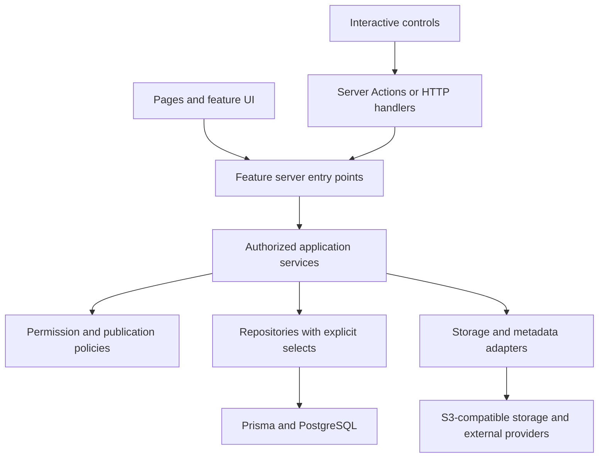

# GemuKore — Repository Architecture

Task: **0.3 — Repository Architecture**  
Date: **2026-09-29**  
Status: **Documentation complete; proposed structure for subsequent implementation tasks.**

## 1. Scope and architectural decision

GemuKore will be one Next.js application in one pnpm package, with a PostgreSQL database and S3-compatible object storage. Use the Node.js runtime for backend work and retain the self-hosted Docker deployment target. A separate API application, monorepo package hierarchy, dependency-injection container, worker service and queue are unnecessary for the current requirements.

This document implements the repository-design deliverable from [DEVELOPMENT_PLAN.md](../../DEVELOPMENT_PLAN.md). It preserves [PROJECT_SPEC.md](../../PROJECT_SPEC.md), the accepted C01–C17 decisions in [ARCHITECTURE_REVIEW.md](ARCHITECTURE_REVIEW.md), and the conceptual boundaries in [DOMAIN_MODEL.md](DOMAIN_MODEL.md). It does not finalize the remaining authentication/provider/renderer implementation details or silently approve every proposed database refinement.

At the start of this task the repository was clean and contained documentation and logo source assets, with no application, package manifest, schema or tests. All paths in the trees below are **planned paths**, except existing documentation and logo files. Do not scaffold the whole tree now or create empty future-feature placeholders. Add files only as the relevant task needs them.

The five principal responsibilities are:

| Layer | Responsibility | Excludes |
| --- | --- | --- |
| UI | Render pages and controls, gather input, show state and accessible feedback. | Database queries, provider calls, permission decisions, aggregate mutations. |
| Features | Organize product screens, reusable contracts, validation and thin request entry points. | ORM models in browser contracts, duplicated business services. |
| Services | Enforce permissions and domain rules, coordinate transactions, select audience-specific outputs. | JSX, navigation, HTTP response construction, provider-specific payloads. |
| Repositories | Implement deliberate query shapes and persistence, including transaction-bound operations. | Authentication from browser cookies, UI behavior, external network calls. |
| Prisma / PostgreSQL | Persist records and enforce the adopted relational constraints. | Product presentation, public DTO construction, provider orchestration. |



Server Actions are themselves feature entry points; a Route Handler can call the same feature entry-point function directly. The diagram does not require an extra forwarding function for each arrow. Modules are ordinary typed functions; create an interface where an external adapter or meaningful test boundary needs it, not for every table.

## 2. Target repository layout

```text
gemu-kore/
  AGENTS.md
  PROJECT_SPEC.md
  DEVELOPMENT_PLAN.md
  README.md
  docs/
    architecture/
      ARCHITECTURE_REVIEW.md
      DOMAIN_MODEL.md
      REPOSITORY_ARCHITECTURE.md
    operations/                     # setup, deployment, backup/restore as introduced
  logo/                             # existing source artwork; preserve it
  public/
    brand/                          # deliberately public, reviewed static brand exports
  src/
    app/                            # Next.js routes and framework entry points
      layout.tsx
      page.tsx
      globals.css
      not-found.tsx
      global-error.tsx
      (auth)/
        login/page.tsx
        access-denied/page.tsx
      (private)/
        app/
          layout.tsx
          page.tsx
          collection/page.tsx
          consoles/...
          games/...
          accessories/...
          locations/...
          catalog/...
          settings/...
      (public)/
        collection/
          layout.tsx
          page.tsx
          consoles/[id]/page.tsx
          games/[id]/page.tsx
          accessories/[id]/page.tsx
      api/
        auth/[...all]/route.ts
        search/private/route.ts
        search/public/route.ts
        catalog/options/route.ts
        media/private/[assetId]/route.ts
        media/public/...
        uploads/...
        health/route.ts
      robots.ts
      sitemap.ts
    components/
      ui/                           # shadcn primitives
      magic/                        # Magic UI sources and project wrappers
      layout/                       # shared layout primitives, not data loaders
      media/                        # image/gallery/video presentation
      three/                        # optional viewer and renderer components
      search/                       # shared search controls
    features/
      auth/
      dashboard/
      collection/
      consoles/
      games/
      accessories/
      catalog/
      locations/
      media/
      search/
      enrichment/
      physical-editions/
      public-collection/
      settings/
    server/
      auth/                         # session resolution and verified-email/grant access
      db/                           # client, transaction helper, generated client
      services/                     # domain/application use cases, grouped by owner
      repositories/                 # persistence, split private/public query surfaces
      policies/                     # shared permission/publication rules
      storage/                      # small S3-compatible adapter and its contract
      providers/                    # structured metadata adapters, e.g. IGDB
      ai/                           # AIService, provider adapters, validated outputs
      search/                       # server-side PostgreSQL query helpers
      config/                       # server-only environment configuration
      http/                         # bounded safe external fetch and transport helpers
      observability/                # redacted logging and request identifiers
    lib/
      utils/                        # small runtime-neutral helpers
      motion/                       # shared animation constants/reduced-motion helpers
      three/                        # pure viewer contract/geometry helpers, added later
  prisma/
    schema.prisma                   # start with one schema file
    migrations/                     # versioned, reviewed database migrations
    seed.ts
    seed-data/                      # small, provenance-aware, stable-key catalog inputs
  tests/
    integration/                    # real PostgreSQL; storage integration where relevant
    e2e/                            # Playwright critical paths
    fixtures/                       # synthetic provider/domain examples and small assets
    helpers/                        # test-only setup and builders
  scripts/                          # explicit operational tasks when required
  package.json
  pnpm-lock.yaml
  tsconfig.json
  next.config.ts
  eslint.config.mjs
  .env.example
  .gitignore
  .node-version
  docker-compose.yml                # development dependencies, Task 1.3
  Dockerfile                        # production packaging, Task 22.1
```

Ellipses mean route families or future files, not literal directory names. Add each category's public list `page.tsx` beside its `[id]` child in Phase 18. Test/build/style/Prisma configuration files are added by their assigned tasks using the supported conventions of the versions selected then. Generated Prisma code lives under `src/server/db/generated/` if the selected generator supports configured output; it is ignored and regenerated, never exposed to browser modules.

There is one root package.json and lockfile. Do not add Turborepo, workspace packages or a second frontend/backend build. Keep the existing `logo/` sources intact; later copy only intended public exports into `public/brand/`. No uploaded photos, GLBs, provider secrets, database dumps or runtime-generated private artifacts belong in `public/` or Git.

Use `@/` for `src/` imports, kebab-case for file names, PascalCase for React components and explicit named exports for reusable application functions. Framework-required default exports remain as required. Do not create broad root barrels that mix client and server modules or eagerly import every feature.

## 3. Routes and identity

### 3.1 URL ownership

| URL family | Audience and purpose | Entry behavior |
| --- | --- | --- |
| `/` | Public entry | Redirect consistently to `/collection`; it does not inspect a session to switch products. |
| `/login` | Authentication | Offer configured OAuth providers. After authorized login, go to `/app` or a validated same-origin private return path. |
| `/access-denied` | Authenticated identity without an enabled grant | Generic denial, no collection data or other users' grant details. |
| `/app` | Authorized private dashboard | The private root; dashboard content arrives in its assigned phase. |
| `/app/collection` | Authorized unified inventory | Private filters, list/grid views and counts. |
| `/app/{consoles,games,accessories}` | Authorized category browsing | Private category list, `/new`, `/[id]`, `/[id]/edit`. |
| `/app/locations` | Authorized location management | Reads for viewers; mutations only for editors/admins. |
| `/app/catalog/...` | Admin canonical management | Catalog admin UI; separate narrow lookup endpoints serve editors adding copies. |
| `/app/settings`, `/app/settings/access`, `/app/settings/public` | Admin management | AppSettings, grants and publication settings respectively. |
| `/collection` | Public museum | Shows the neutral private-collection message when disabled; never becomes a private dashboard for a logged-in user. |
| `/collection/{consoles,games,accessories}` | Public category browsing | Published copies and allowed filters/counts only. |
| `/collection/{consoles,games,accessories}/[id]` | Public copy detail | `id` is the owned CollectionItem UUID. Type must match the route and the item must be publishable. |

**Use the existing item UUID for both private and public copy identity.** Two copies of the same catalog release have different detail URLs. Titles, edition names and catalog slugs are display metadata, not lookup keys for owned copies. This resolves the specification's previous `[slug]` placeholders without introducing another persisted public identifier or redirect history. Decorative title slugs are deferred; they are not needed for the MVP.

Catalog detail/edit URLs, when needed, use canonical entity IDs under `/app/catalog/...`. Never reinterpret a release ID as an owned-copy ID because both are UUID strings. Invalid, unpublished, wrong-category and nonexistent public item IDs return the same generic not-found behavior without revealing private labels. If the global public toggle is off, category/detail requests expose no item existence or metadata; the root alone provides the neutral status message.

Route groups such as `(private)` and `(public)` organize layouts without adding URL segments. The actual private URL prefix is the literal `app/` directory under the group. Keep one root layout, with private/public nested shells. [Next.js route groups](https://nextjs.org/docs/app/api-reference/file-conventions/route-groups).

These route choices describe the finished product, not Task 1.1 scope. Before the relevant UI phase, leave future pages unimplemented; the initial boot page may be a minimal foundation page rather than redirecting to a nonexistent museum.

### 3.2 HTTP surfaces

Use Server Components plus feature queries for initial reads and Server Actions for ordinary form mutations. A server-rendered page does not make an HTTP request to its own API to fetch database data. Route Handlers exist only where an actual HTTP contract is useful:

| Handler | Purpose and boundary |
| --- | --- |
| `/api/auth/[...all]` | Better Auth integration, finalized against the pinned adapter in Phase 3; not an application authorization shortcut. |
| `/api/search/private` and `/api/search/public` | Debounced browser search/command palette. Different input allowlists, query shapes and DTOs. |
| `/api/catalog/options` | Authorized minimal catalog choices for forms. Editors need lookup access, not catalog mutation/admin access. |
| `/api/uploads/...` | Authenticated initiation/completion and upload transport when required. Progress/file handling is not forced through a large Server Action payload. |
| `/api/media/private/[assetId]` | Authorized private media delivery. Check grant and asset/use scope; knowing an ID is insufficient. |
| `/api/media/public/items/[itemId]/[useKind]/[useId]` | Public catalog/personal media resolved through a published item's allowed association. `useKind` is an allowlisted discriminator, not an arbitrary table name. |
| `/api/media/public/components/[itemId]/[componentId]/[slotKey]` | Public approved component geometry/textures. A reserved geometry key and template-defined slot keys are resolved server-side. |
| `/api/media/public/site/[useId]` | Explicitly approved application branding while publication is enabled. |
| `/api/health` | Minimal liveness response; dependency readiness is a protected operational check when introduced, never a credential/config dump. |

Media handlers resolve the actual asset and derivative from database relationships. Do not accept a client-supplied object key, bucket, arbitrary URL or asset ID as a substitute for the public context checks. Original-download capability, if later exposed privately, is an explicitly authorized operation; ordinary media display prefers prepared derivatives.

GET handlers are read-only. HTTP mutations apply origin/CSRF controls appropriate to their transport, validation and server authorization. Do not duplicate every service with a REST endpoint. Use separate `page.tsx` and `route.ts` URL locations where Next.js routing would otherwise collide. `robots.ts`, `sitemap.ts` and dynamic metadata are application entry points too: they must use the public query contract and honor enabled/indexing settings.

## 4. Feature shape and allowed dependencies

### 4.1 A feature's typical files

```text
src/features/games/
  contracts.ts                     # input/output DTOs; runtime-neutral
  schemas.ts                       # client-safe Zod shape validation
  rules.ts                         # pure, testable product calculations when needed
  queries.server.ts                # server-only authenticated read entry points
  actions.ts                       # explicit exported Server Actions
  components/
    game-list.tsx                  # rendering only
    game-form.client.tsx           # interactive form boundary
    game-card.tsx
  rules.test.ts                    # meaningful pure-behavior tests when rules exist
  components/game-form.test.tsx
```

This is a convention, not a generator template: omit unused files. Feature contracts must not import Prisma, server environment configuration, provider SDKs or server entry points. Server-only validation such as foreign-key existence, permissions and current revision belongs in services, even when basic input shape is shared with the browser.

`queries.server.ts` obtains trusted server request context, parses route/filter inputs and invokes the relevant service. `actions.ts` is a deliberately small transport boundary: parse unknown input, resolve server context, call the service, translate domain errors and refresh affected views after commit. An action module exports only intended callable actions. A `.server.ts` suffix is a naming cue; server-only imports/build rules enforce the actual boundary.

The `games`, `consoles` and `accessories` features organize screens. They do not own competing copies of catalog logic. A game's owned-copy edit calls the collection service; canonical release editing calls the catalog service. `features/catalog` hosts canonical-management UI. `features/physical-editions` presents components/templates without becoming a separate inventory engine.

### 4.2 Import rules

| Importer | Allowed | Forbidden |
| --- | --- | --- |
| `app/**/page.tsx`, layout and metadata entry points | Feature components, feature server queries, public presentation helpers. | Prisma/repositories/provider SDKs; embedded business transactions. |
| `app/**/route.ts` | Feature HTTP/query entry functions and shared transport helpers; auth handler is an explicit integration exception. | Direct domain SQL or duplicated business/authorization logic. |
| Feature presentation components | Own feature contracts/rules/components and shared presentation primitives. | Repositories, database client, provider adapters, secret configuration. Server query loading occurs in entry containers, not reusable cards/forms. |
| Client feature modules | Runtime-neutral contracts/schemas/rules, client/shared UI and explicit action references. | Ordinary `server/**` or `*.server.ts` imports. The framework's action proxy is the deliberate exception. |
| Feature server entry points | Services, server auth/context, transport helpers, neutral contracts/schemas. | Repository model calls and duplicated domain policy. |
| Services | Repositories, policies, validated neutral feature contracts/rules, necessary adapters and transaction helper. | React, `app/`, feature components/actions/queries, redirects and HTTP response construction. |
| Repositories | Prisma client/types, transaction handle and server-local persistence helpers. | Services, React, user cookies and external provider/network calls. |
| Provider/storage adapters | Their explicit contracts, SDKs, server config and bounded HTTP helpers. | React, application actions, direct catalog mutation and database access. |
| Shared `components/` | Shared UI/presentation helpers and small presentation contracts. | Feature-specific loaders/services or runtime feature-module dependency cycles. |
| `lib/` | Small runtime-neutral utilities and dependency-light presentation helpers. | Database/config/auth imports or a miscellaneous home for business services. |

A service importing `features/games/contracts.ts` is allowed; importing `features/games/index.ts` that reexports actions is not. Keep these neutral leaves explicit so the file-level graph remains acyclic even though server services and feature server entry points occupy different top-level folders. Shared component prop contracts belong with the shared component, not in a feature it would need to import.

Mark server entry modules, auth, repositories, services and adapter/config roots with `server-only`. Use `use client` only at the interactive boundary. `use server` identifies transport actions, not an arbitrary private utility folder. Exported actions must be treated as externally callable and return only intended data; the framework marker does not confer application permission. [Next.js data security](https://nextjs.org/docs/app/guides/data-security).

Enforce these rules incrementally with existing ESLint restricted-import rules, the server-only build boundary and focused review. No extra architecture-analysis dependency is required initially. Only repositories, `server/db`, the explicit Better Auth adapter binding and controlled seed/migration tooling may import the database client. Services may request a transaction through the db helper but must not call Prisma model methods themselves. A test exception must remain in test configuration and must not disable production server/client checks.

## 5. Services, repositories and transaction ownership

### 5.1 Service owners

Group server services by responsibility rather than creating one class per database table:

| Service area | Owns |
| --- | --- |
| `catalog/` | Canonical companies, markets, platforms/models, games/releases, accessory variants, compatibility, expected components/templates and MetadataChange. |
| `collection/` | Owned root/subtype create/edit/delete, defects, actual contents, aggregate revisions and copy re-identification. |
| `locations/` | Location hierarchy validation, serialized moves and safe deletion. |
| `media/` | Upload lifecycle, asset uses/defaults/overrides, provenance, eligibility evaluation and authorized delivery. Split private/public entry modules. |
| `enrichment/` | Provider orchestration, runs/suggestions, conflicts and transactional accepted-change workflow through catalog operations. |
| `publication/` | ADMIN-only global public settings, item publication and explicit media/component approvals. |
| `public-collection/` | Dedicated public lists/details/stats/metadata DTOs; never wraps a private read and removes fields. |
| `search/` | Separate private/public search use cases and input capabilities; shared query helpers only where audience-safe. |
| `settings/` | General AppSettings, excluding publication settings. |
| `access/` | AccessGrant management. Auth session/account lifecycle remains owned by Better Auth integration. |

These are logical owners, not ten required folders on day one. Begin with files and split into a directory when there are several related operations. Services may call explicit lower-level operations of another owner, but no service cycle is allowed. For example, enrichment may call catalog acceptance; catalog never calls enrichment to complete a write. Publication may reuse media eligibility; media eligibility imports a pure publication policy rather than calling back into publication mutation services.

`server/policies/` owns shared permission and publication predicates. Policies consume narrow facts/context and cannot fetch data. Auth context and publication facts are loaded through their own server boundaries, so a policy is reusable without hiding a database read inside a boolean helper.

Task 3.1's [AUTH_ARCHITECTURE.md](AUTH_ARCHITECTURE.md) specifies the identity-to-grant context, provider guards, session lifecycle, permission matrix and bootstrap/revocation contract. Auth server configuration belongs under `server/auth/`; client login controls and their client SDK belong under `features/auth/`, preserving the shared import boundaries reviewed in Task 2.4.

### 5.2 Repositories

Repositories express operations such as loading a release identity, listing owned games, inserting an item/subtype within a transaction, or selecting a public item projection. A repository is not a generic endpoint that accepts arbitrary client-provided Prisma `where`, `include`, `select` or sort objects.

Suggested grouping is `repositories/catalog/`, `collection/`, `media/`, `public/`, `enrichment/`, `settings/` and `access/`, introduced as needed. Public read queries live under `repositories/public/`; private collection repositories are not a dependency of the public collection read service. The media public-delivery path likewise uses narrow eligibility/context projections. Controlled reuse of a pure predicate builder is acceptable; reuse of a full private query is not.

Return selected server-local persistence records to services, which map them into feature DTOs. Services may compose several repositories; they must not return the raw joined ORM model to UI. Prevent N+1 behavior with deliberate joins/batched lookups and paginated lists, not by making components issue their own queries.

### 5.3 Transaction ownership

The outer use-case service owns the transaction. Repositories accept its transaction handle for multi-record writes and never start independent nested transactions. The helper in `server/db/transaction.ts` can expose a typed handle without allowing UI/client modules to import Prisma types.

Examples:

- Creating an owned game writes its CollectionItem, matching OwnedGame and any ready media attachments atomically. Foreign keys and the adopted subtype constraint remain the final integrity boundary.
- Catalog edits update facts, root revision and MetadataChange together. Seed updates use the same preservation rules; idempotent seeding does not overwrite manual fields implicitly.
- Enrichment acceptance opens one transaction, rechecks ADMIN permission and target revision, calls catalog's transaction-aware mutation operation, writes provenance and finalizes suggestion decisions. A conflict changes nothing.
- A location move acquires its hierarchy lock and validates ancestors before writing, in one short transaction.
- Claiming an unreferenced asset for deletion coordinates with attachment through the asset row/state; object-store deletion is a separate retryable lifecycle step.

Keep external API calls, uploads, image transformations and GLB processing outside database transactions. Use explicit pending/ready/failed states where the database and storage cannot commit atomically. Do not introduce a message bus or outbox merely to refresh UI after a successful database commit.

## 6. Contracts, validation and errors

Define purpose-specific DTOs in neutral feature contracts. Examples include `OwnedGameDetail`, `ReleaseOption`, `PublicGameDetail`, `EnrichmentPreview` and a shared `ModelPresentation` contract. These are view/input contracts, not duplicate canonical persistence entities.

| Boundary | Required behavior |
| --- | --- |
| Browser → action/handler | Treat every argument, path ID, form field, return path and URL filter as untrusted. Parse an explicit Zod input shape; reject unexpected permission/publication fields. |
| Request entry → service | Pass normalized input and trusted server-created access context. Client user/role values are ignored rather than used to construct this context. |
| Service → repository | Pass bounded domain criteria and an optional transaction handle, never a browser query object. Validate IDs exist and represent the expected entity type. |
| Repository → service | Return only the fields necessary for that use case; keep generated Prisma types on the server. |
| Service → UI/browser | Return an explicit DTO. Convert dates/decimal/bigint values deliberately, preserve unknowns, and never include storage credentials, object keys, raw provider payloads or history by accident. |

Public DTOs are independent allowlisted types, not `Omit<PrivateItem, ...>`. Public projections must also constrain selection, filters and counts. A typed DTO alone does not prevent an object spread from carrying extra runtime properties. Explicit mappers and privacy tests enforce the runtime output.

Client validation improves feedback; server validation is authoritative. Cross-record checks, accepted roles, current revisions, publication and slot/template compatibility are service/database concerns. Shared schemas are not permission systems.

Use a small shared domain-error vocabulary: validation, unauthenticated, forbidden, not-found, conflict and external-service-unavailable. Expected failures become structured action results or appropriate HTTP responses. Unexpected failures get a request identifier and redacted server log; no stack, SQL, secrets or private object dump is returned. UI can say whether a save succeeded and offer a safe next step.

Keep redirects/not-found framework control flow in route/feature transport entry points, outside broad error-catching blocks that would turn successful redirects into failures. Services express outcomes without importing framework navigation. Redirect targets are fixed or validated same-origin paths. `error.tsx` supplies retry/fallback UI; normal field errors stay with their form. Add `loading.tsx`, local Suspense boundaries and not-found handling where the feature needs them, not mechanically at every folder level.

## 7. Rendering and interactive boundaries

Server Components are the default for pages, shells and data-backed entry containers. Load data through feature queries and pass narrow presentation contracts to components. Mark only interactive forms, search controls, galleries, theme controls and viewer launchers as Client Components. A client provider can wrap server-rendered children without requiring the whole application tree to become client code.

The private layout checks access to provide the correct navigation experience. That check does not authorize a directly invoked action or handler. Every private service entry requires trusted context and checks the permission needed for the operation; mutations recheck relevant current access before committing. Hiding a button is presentation, not enforcement. A public page uses the same public contract for every visitor, including an authenticated administrator.

Keep shadcn/ui primitives in `components/ui/`; feature composition belongs in the feature. Place purposeful Magic UI effects in `components/magic/` and shared Motion conventions in `lib/motion/`. Respect reduced motion, keyboard navigation and readable focus states. Do not make animation or a successful WebGL context necessary to navigate or save an item.

### 7.1 3D is an optional presentation boundary

Use a small Client Component launcher that loads the viewer only when requested or otherwise justified by its feature design. The heavy Three.js / React Three Fiber imports belong inside that lazy graph. Next.js requires `ssr: false` dynamic loading to be declared from a Client Component; do not place it directly in a Server Component. [Next.js lazy loading](https://nextjs.org/docs/app/guides/lazy-loading).

`components/three/` owns rendering and controls; `lib/three/` owns renderer contracts and reusable geometry calculations. Keep lightweight contracts separate from helpers that import the rendering engine. A shared card or barrel must not eagerly import the viewer. Collection grids show static imagery; they do not allocate a WebGL scene per card.

The service supplies a `ModelPresentation` containing only the selected approved model/texture delivery URLs, validated template configuration and fallback presentation data. The renderer never queries Prisma, interprets catalog permissions or invents an asset fallback that bypasses publication checks. Private and public services can produce the same presentation shape through different authorization paths.

Custom MVP models are self-contained GLB files. No renderer-originated download of arbitrary remote textures is permitted. Template geometry and artwork bindings remain separate from owned physical condition and presence. Missing models, missing artwork, reduced motion, unsupported devices and viewer errors all preserve the static detail view. Exact geometry/UV schemas and performance budgets remain Tasks 9.1 and 14.1.

## 8. Public projections, media delivery and caching

### 8.1 Publication is checked at every output surface

Public list, detail, search, filter options, counts, metadata, sitemap and media services must apply the publication policy. Do not load a private aggregate and attempt to remove sensitive fields after serialization. Public HTML, React Server Component payloads and error responses are outputs subject to the same restrictions as JSON.

Public item reads require publication globally enabled and the individual item published. Media additionally requires an approved use, an eligible display asset and any applicable personal-photo setting. Component models and each artwork slot are evaluated independently. Missing or ineligible private artwork results in a safe placeholder, not a fallback to its original. These gates implement the domain model's approval rules; linking an asset to a catalog entity alone does not publish it.

Original objects remain private. Explicitly prepared DISPLAY derivatives can be delivered when their provenance, rights and public-safety status permit it. Public handlers derive their storage lookup from the approved relationship; public URLs are use/context identifiers rather than object-store addresses. The same shared asset can be eligible in one published context and unavailable in another.

### 8.2 Baseline delivery policy

Use authorized application streaming from private object storage for collection media. The handler evaluates the applicable current gates on each request before opening the object. Do not redirect public collection reads to long-lived object-store URLs. Signed upload URLs may be used for bounded authenticated upload operations; they do not grant read access or make an uploaded object ready for display.

Use `Cache-Control: private, no-store` for authenticated data/media and `Cache-Control: no-store` for policy-dependent public data/media. Configure page/data rendering to read current policy rather than using static generation, ISR or persistent shared response caches for these surfaces. The precise supported Next.js configuration is chosen with the installed version. Request-local deduplication is acceptable after context is established; permission or publication results must not outlive the request through shared memoization.

Do not add a service worker or CDN rule that caches these responses. An HTTP conditional request must pass authorization before returning a 304; every range request for a GLB or video must also pass the gates. A request admitted before a publication change can already be in flight, and bytes already downloaded cannot be recalled. The guarantee is that new requests evaluated after the committed change cannot acquire newly unauthorized content. Refresh affected visible views after successful mutations without claiming that refresh erases previously delivered copies.

Next.js's default image optimizer does not forward authentication headers. Use prepared derivatives with `unoptimized` image delivery for authenticated and revocable public collection media, so the authorized handler remains in the request path. Ordinary permanently public static brand exports may use standard optimization and caching. [Next.js Image reference](https://nextjs.org/docs/app/api-reference/components/image).

This intentionally favors simple revocation behavior over maximum cache efficiency for a hobby collection. A later signed-read/CDN design requires an explicit tolerated access lifetime and invalidation policy before adoption; it is not an implementation shortcut. Phase 5 implements private delivery; Phase 18 verifies the complete public delivery and revocation behavior before publication is enabled.

## 9. Representative request flows

| Flow | Responsibilities in order |
| --- | --- |
| View a private game | Page passes route/filter input to a feature query → query resolves trusted access → collection service checks read permission → repository selects the owned root, release summary and allowed personal fields → service maps DTO → components render. |
| Add an owned game | Editor selects existing catalog options → action validates submitted copy data → collection service checks EDITOR/ADMIN permission and selected release → transaction writes owned root/subtype and valid attachments → action refreshes private views. No provider call is required to save. |
| Edit canonical metadata | Admin feature action → catalog service checks ADMIN and expected revision → transaction updates facts and MetadataChange → explicit DTO result. An editor's copy form cannot perform this operation indirectly. |
| Publish a photo | ADMIN reviews a prepared display derivative and its provenance → publication service validates the relevant item/use/asset gates → commits the explicit approval → later public media requests independently reevaluate current eligibility. |
| Upload a personal image | Authorized initiation reserves a bounded pending asset → bytes arrive in private storage → completion checks actual size/type/content and prepares derivatives → ready status permits attachment. A failed or incomplete upload never becomes public by inheritance. |
| Enrich metadata | Authorized service calls provider/AI adapter outside a transaction → validated suggestions and evidence are stored → ADMIN reviews fields → acceptance rechecks revision and permission → catalog mutation and provenance commit atomically. Retry or conflict must not duplicate acceptance or silently overwrite manual facts. |

These flows describe responsibility placement, not functionality to implement in Task 0.3. Do not add disabled future-feature controls simply because a folder or service is named here.

## 10. Configuration, adapters and deployment

Use `server/config/` for validated server environment configuration. Validate required configuration when its capability is enabled; an absent optional AI/provider credential must not break manual collection features. Introduce basic environment conventions in Task 1.1, database configuration in Task 1.2, auth in Phase 3, storage in Phase 5 and provider settings in their phases.

`.env.example` contains variable names, safe examples and explanations; local secret files are ignored. Secrets never use the `NEXT_PUBLIC_` prefix or enter browser contracts/logs. Build-generated public configuration is not a substitute for mutable AppSettings/PublicSettings. Avoid build-time database reads, live provider calls or seeds. Select and pin compatible supported dependency versions in the applicable foundation task, commit the lockfile and document the runtime version.

External services sit behind small typed adapters in `server/storage/`, `server/providers/` and `server/ai/`. Provider SDK responses are validated and normalized on the server; raw payloads are not feature contracts. External requests use timeouts, bounded retries and redacted diagnostics. The later enrichment tasks define concrete quotas and mappings. No general plugin engine or mandatory factory hierarchy is needed for one adapter.

Use one application instance initially, PostgreSQL and a private S3-compatible store such as the selected development MinIO service. Runtime objects are stored outside the app container; temporary processing files are disposable. Database-backed auth avoids in-memory session ownership. Long transformations or enrichment operations use persisted status and explicit retry operations where needed; do not rely on untracked fire-and-forget promises surviving a request or deploy. Add dedicated background infrastructure only through an intentionally revised requirement.

Production packaging can use Next.js standalone output, with its static assets included and a reverse proxy in front. Self-hosting guidance recommends a reverse proxy for request handling protections. Exact packaging, limits, readiness and operations belong to Phase 22. [Next.js self-hosting](https://nextjs.org/docs/app/guides/self-hosting).

Task 1.3 defines development app, PostgreSQL and MinIO services while also allowing Next.js to run locally against containerized dependencies. Its development configuration and Phase 22's production application image are separate deliverables. Keep the deployment compatible with Docker and ordinary Node.js hosting; do not require a Vercel-only storage, function or identity service. The public health route reports liveness only. Operational scripts reuse domain services for business mutations, with an explicit trusted operator context rather than a fabricated web session or a public authorization bypass.

## 11. Persistence, migrations and tests

### 11.1 Prisma and migration ownership

Begin with one `prisma/schema.prisma`. Add models according to the domain document's Task 4.1 core subset and later feature additions; the existence of a planned feature directory is not a reason to create its tables early. Keep generated client output ignored and behind `server/db/`.

Version and review migrations. Database constraints that Prisma cannot express directly, including adopted checks/triggers, belong in migration SQL and integration tests. Do not replace those constraints with UI validation. Runtime domain SQL belongs in repositories; schema SQL belongs in migrations. Seed entry points and the authentication adapter are explicit infrastructure exceptions to repository-only access, scoped to their duties and never imported by UI.

Use stable keys and small controlled fixtures for seeds. Separate production-safe reference seeds from synthetic test data. A repeat seed preserves manual changes and creates no duplicate catalog identities. No private collection exports, provider tokens or personal originals belong in committed fixtures.

### 11.2 Tests follow risk and ownership

| Test level | Placement and purpose |
| --- | --- |
| Unit/component | Colocated `*.test.ts(x)` tests for meaningful policy, normalization, presentation and interaction behavior. Vitest and React Testing Library are introduced by their assigned setup tasks. |
| Integration | `tests/integration/`; real isolated PostgreSQL for repositories, transactional services and database constraints. Add object-store integration when media exists. |
| End-to-end | `tests/e2e/`; Playwright for critical user journeys and direct request authorization, using controlled test identities and fixtures. |

Test helpers live outside application import paths. Production application code must not contain a test-only permission bypass. Mock external providers at the adapter boundary; do not mock away the relational constraint being tested. Database/storage fixtures must be isolated from personal development data.

As features arrive, prioritize these checks:

- Owned root/subtype integrity, valid canonical targets, location cycles and atomic rollback, including direct database writes where constraints are the guarantee.
- Viewer/editor/admin permissions through actions and handlers, including direct calls without navigating through a guarded layout.
- Public projections across HTML, server payloads, search, counts, metadata and media; private fields never appear merely because the visitor has an admin session.
- Turning publication off or withdrawing approval prevents subsequent media/data requests, including conditional/range requests and previously obtained delivery URLs.
- Manual game creation succeeds without providers; enrichment acceptance preserves reviewed values, detects revisions and handles retries.
- Static fallback, keyboard operation, reduced motion and mobile interaction remain usable without a loaded 3D viewer.

Establish import restrictions before feature implementation: client modules cannot import server modules; UI cannot import repositories/Prisma; services cannot import UI/actions; public reads cannot import private repositories. Combine lint/build safeguards with review of transitive imports. Rules should enforce the actual active tree, not demand placeholder modules for future features.

Foundation tasks should expose consistent commands for lint, typecheck, unit tests, integration tests, end-to-end tests and production build (`pnpm lint`, `pnpm typecheck`, `pnpm test`, `pnpm test:integration`, `pnpm test:e2e`, `pnpm build`) as each capability is configured. They do not exist yet. Run applicable checks for each implementation change; this documentation task does not claim an application build or runtime test result.

## 12. Phased handoff and completion

| Task/phase | Repository consequence |
| --- | --- |
| 1.1 | Initialize the single Next.js/TypeScript/pnpm application, minimal boot page, styles/lint/format conventions and safe basic environment template. No domain features or future empty directories. |
| 1.2–1.4 | Introduce Prisma connection/configuration, development dependencies and test infrastructure according to their individual task scopes. |
| 2–3 | Add UI primitives/shells and auth/access boundaries; keep business modules independent of JSX and auth provider internals. |
| 4 | Implement the core adopted schema/repositories/services and integrity checks, covering all three item categories without implementing their later screens. |
| 5–7 | Add asset/storage boundaries, shared presentation and search infrastructure when assigned; distinguish public/private contracts from the outset. |
| 8–11 | Deliver category functionality, optional console 3D and the complete manual game workflow in plan order. |
| 12–14 | Add provider/AI adapters and reviewed suggestions, followed by physical templates/rendering in the assigned tasks. |
| 16 | Add accessory workflows using the existing family/variant/owned-item boundaries. |
| 18 | Implement the public museum, dedicated projections and context-authorized delivery; verify publication gates before enabling it. |
| 22 | Package and document production deployment, backup/restore and operational checks. |

This table highlights architectural milestones; omitted phases still follow the development plan. It does not authorize skipping tasks, running prerequisites automatically or starting the next task. Detailed provider mappings, GLB processing limits, renderer schemas, exact Prisma migration syntax and deployment settings remain owned by their feature tasks.

The repository design deliberately avoids a universal entity layer, generic CRUD repository framework, duplicated public/private applications, a second API server, eager 3D bundles and new infrastructure for hypothetical scale. A small number of ordinary modules can satisfy each boundary. Split files only when responsibilities or size justify it.

Task 0.3 is complete when the planned folder ownership, dependency rules, route identities, privacy boundaries and staged handoff above are documented and cross-references are consistent. No application source, database schema, migration, dependency or infrastructure configuration is created by this task. The next executable task is **Task 1.1 — Initialize Application**, subject to the user's instruction to start it.
