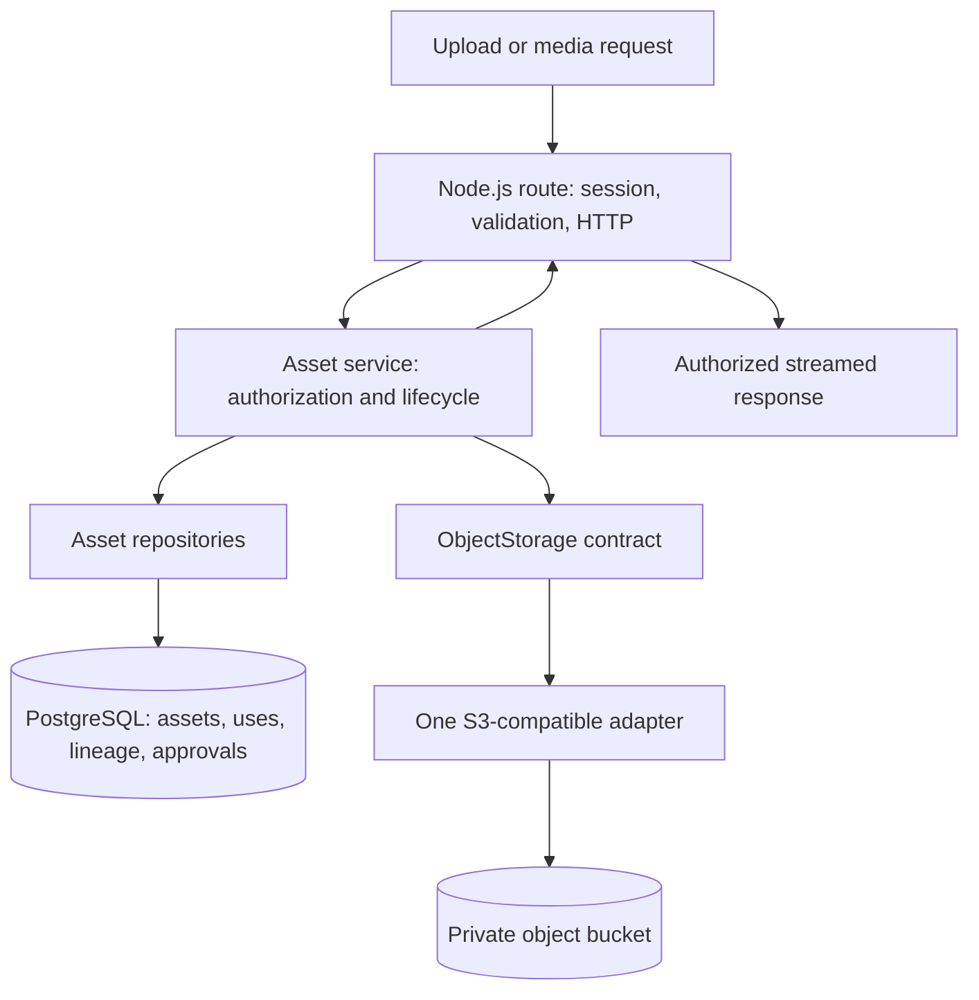

# GemuKore — Storage Architecture

Task 5.1 · Reviewed 2026-10-04 · Design complete; implementation begins in Task 5.2.

Task 5.2 implementation/configuration and verification are recorded in [STORAGE.md](../operations/STORAGE.md). This document retains the approved design and future-phase boundaries.

## 1. Recommended architecture

Use one small server-only storage contract and one configurable S3-compatible adapter. MinIO remains the local development service; Cloudflare R2, DigitalOcean Spaces, Backblaze B2 and AWS S3 are deployment options behind that same adapter. PostgreSQL owns asset identity, provenance, lifecycle and permissions; object storage owns file bytes. Neither a bucket setting nor an object URL grants application access.

This design implements the accepted decisions in [ARCHITECTURE_REVIEW.md](ARCHITECTURE_REVIEW.md), [DOMAIN_MODEL.md §6](DOMAIN_MODEL.md#6-assets-uses-and-provenance) and [REPOSITORY_ARCHITECTURE.md §8](REPOSITORY_ARCHITECTURE.md#8-public-projections-media-delivery-and-caching). It does not reopen the catalog/copy splits or introduce another asset schema.

Use one private bucket per environment, containing both originals and display derivatives. Development/test/production buckets and credentials are separate. Database delivery class and permission checks, rather than bucket prefixes, control access. The application streams authorized reads instead of returning signed download links. This keeps current publication and grant checks in the request path, including after a committed revocation. Files already delivered and requests already admitted cannot be recalled.

## 2. Boundaries and minimum contract

Follow the planned `src/server/storage/` location. Use the AWS SDK for JavaScript v3 inside the S3 adapter only; select and pin its compatible version during Task 5.2. Using an S3 SDK is an implementation choice, not an AWS hosting requirement. No SDK commands, response types or provider URLs belong in services, repositories, UI contracts or browser bundles.

| Layer           | Responsibility                                                                                                               |
| --------------- | ---------------------------------------------------------------------------------------------------------------------------- |
| Route/action    | Current session, request validation, bounded body reception, HTTP status/headers and response streaming.                     |
| Asset service   | Permission checks, scope, object-key allocation, lifecycle transitions, content validation, provenance and use approval.     |
| Repository      | Explicit database reads/writes, references and row locks within service-owned transactions.                                  |
| Storage adapter | Configured connection, byte operations, timeouts, retries and normalized storage failures; no database or publication logic. |

The neutral contract needs only these operations initially:

| Operation | Input / result                                                                                                         | Required behavior                                                                                                                      |
| --------- | ---------------------------------------------------------------------------------------------------------------------- | -------------------------------------------------------------------------------------------------------------------------------------- |
| `put`     | Logical locator, replayable byte source, known length, validated MIME and minimal technical metadata → object receipt. | Upload bounded bytes; never expose bucket ACL or public URL options. Caller controls immutable-key lifecycle.                          |
| `get`     | Locator, optional single byte range and cancellation signal → readable stream, length and range metadata.              | Stream with backpressure; do not buffer a complete model in memory. Propagate cancellation and midstream errors.                       |
| `stat`    | Locator → normalized size, content type and optional opaque ETag, or missing result.                                   | Only a confirmed missing object is absence. Authentication failures, timeouts and outages remain failures.                             |
| `remove`  | Locator → success or normalized failure.                                                                               | Removing an already absent current object succeeds; retries must be safe. This is not a promise to purge retained historical versions. |

Map provider failures to small internal categories: missing object, invalid range/input, access/configuration failure and temporary unavailability. Do not leak provider errors, request signatures or credential-bearing URLs to clients. Routes map failures after authorization; an unknown public context and a forbidden public context receive the same non-disclosing response.

Keep inventory/reconciliation and bucket administration in explicit operator tooling. Do not add a generic provider registry, per-provider business services, filesystem fallback, public URL builder, multipart API or storage-health requirement to the public liveness endpoint. A temporary local file used for validation is disposable working space, never durable asset storage.

## 3. Configuration and provider compatibility

Retain the existing server-only `S3_ENDPOINT`, `S3_REGION`, `S3_BUCKET`, `S3_ACCESS_KEY_ID` and `S3_SECRET_ACCESS_KEY`. Task 5.2 should add an explicit path-style option, proposed as `S3_FORCE_PATH_STYLE`; parse it as a boolean, not JavaScript string truthiness. Use the initial logical namespace `primary` mapped by server configuration to these settings. No namespace-selection UI or multi-provider configuration framework is needed.

Validate the storage configuration when the storage capability is enabled. Partial configuration fails clearly with field names and no values. Do not make an absent integration prevent unrelated manual features from running. Endpoints come from trusted deployment configuration, never from an upload request. Production connections use HTTPS; local HTTP is confined to the trusted development MinIO network/loopback.

| Provider            | Endpoint and signing region                                                                              | Addressing / deployment notes                                                                                                                                                                                                                                                                                             |
| ------------------- | -------------------------------------------------------------------------------------------------------- | ------------------------------------------------------------------------------------------------------------------------------------------------------------------------------------------------------------------------------------------------------------------------------------------------------------------------- |
| MinIO, local        | Host: `http://127.0.0.1:9000`; Docker app: `http://minio:9000`. Region `us-east-1` in the current setup. | Path-style enabled. Existing root credentials are a local sandbox convenience; production application credentials must be bucket-scoped.                                                                                                                                                                                  |
| Cloudflare R2       | `https://<account-id>.r2.cloudflarestorage.com`; region `auto`.                                          | Explicit path-style configuration, initially enabled; verify against the chosen account. R2 implements a subset of S3 and does not support the S3 ACL API. [R2 compatibility reference](https://developers.cloudflare.com/r2/api/s3/api/).                                                                                |
| DigitalOcean Spaces | `https://<datacenter>.digitaloceanspaces.com`; use the SDK recipe's signing region `us-east-1`.          | Virtual-host addressing, path-style disabled. Endpoint selects the datacenter; signing region is not the datacenter name. [Official SDK recipe](https://docs.digitalocean.com/products/spaces/reference/aws-sdks/), [compatibility reference](https://docs.digitalocean.com/products/spaces/reference/s3-compatibility/). |
| Backblaze B2        | `https://s3.<region>.backblazeb2.com`; use the bucket's B2 region.                                       | Both addressing styles are supported; initially use path-style. Endpoint excludes the bucket name. Use a restricted B2 application key and Signature v4. [B2 endpoint/authentication reference](https://www.backblaze.com/docs/cloud-storage-call-the-s3-compatible-api).                                                 |
| AWS S3              | Regional endpoint `https://s3.<region>.amazonaws.com`; matching bucket region.                           | Virtual-host addressing, path-style disabled; private general-purpose bucket and scoped runtime identity. [AWS regional endpoints](https://docs.aws.amazon.com/general/latest/gr/s3.html).                                                                                                                                |

These are configuration profiles for one adapter, not five implementations. Compatibility means more than matching operation names: checksum headers, streaming bodies, ranges and error responses must work with the pinned SDK. Recent AWS SDKs enable automatic checksum behavior; configure checksum calculation/validation explicitly inside the adapter. Start with the documented `WHEN_REQUIRED` compatibility settings, then test required checksum handling with each enabled provider. GemuKore separately computes SHA-256 for file identity and restore verification; optional object metadata containing that hash is not independent proof of stored bytes. [AWS checksum settings](https://docs.aws.amazon.com/sdkref/latest/guide/feature-dataintegrity.html).

An ETag is opaque provider metadata, not GemuKore's SHA-256 and not a portable content checksum. Encryption and multipart uploads can change its meaning. [AWS object/ETag reference](https://docs.aws.amazon.com/AmazonS3/latest/API/API_Object.html).

Do not send ACL headers, require bucket-policy APIs or assume provider-specific versioning, notification, CDN or lifecycle features. Provision the bucket privately outside application startup. The runtime needs object read/write/delete rights for the application's prefix, not bucket creation or account administration; use a separate operator identity for backup/inventory where possible. Disable public bucket/custom-domain delivery. Browser-to-storage CORS is unnecessary for the initial application-mediated upload/download flow.

The existing local MinIO source build is reproducible, but its community repository is archived. Keep it as the development fixture and reassess a maintained production service at deployment. This task selects no paid service and makes no live-cloud compatibility claim. [Existing build details](../operations/DOCKER_DEVELOPMENT.md#minio-source-build), [upstream status](https://github.com/minio/minio).

## 4. File identity and metadata

Persist the approved `(storageNamespace, objectKey)` locator in `Asset`; do not persist endpoint URLs, bucket URLs or signed URLs as authority. Unknown namespaces fail closed. With one configured backend, `primary` suffices; changing its mapping is a controlled migration, not a way to silently redirect existing assets to an empty bucket.

Generate opaque keys on the server, for example `assets/<asset-uuid>/<random-uuid>.jpg`. The extension follows validated content. Do not use original filenames, collection titles, emails, serial numbers, location names or checksums as object keys. Keys contain no personal data and are not access tokens.

Object identity and READY bytes are immutable. Replacing, resizing, sanitizing or optimizing a file creates another Asset/key with dependency lineage. SHA-256 is nonunique: equal bytes may prompt a duplicate warning or carefully scoped reuse, but never inherit another use's approval or privacy scope. Do not merge catalog and collection assets merely because their hashes match.

PostgreSQL remains authoritative for MIME, byte count, dimensions, provenance, original filename, rights, public safety and state. Store only necessary technical object metadata, such as validated content type and an internal asset identifier. Exclude private descriptions, imported payloads, source URLs and approval flags from object metadata. An object-store metadata response does not establish content validity or permission.

## 5. Upload and derivative lifecycle

Initial uploads pass through an authenticated Node.js application route. This avoids a second browser credential/CORS flow and limits the body before storage and decoding. Receive a bounded file into disposable working space, validate actual bytes and compute its length/hash; use a replayable file stream for upload. Preserve backpressure and clean up temporary files on success, cancellation and failure.

1. In a short transaction, authorize the operation and reserve a PENDING Asset with a generated locator and scope. New provenance defaults to unknown rights and non-public safety.
2. Outside the transaction, receive/validate the file and upload it privately. Reject size/type/resource violations; do not trust client MIME, filename or declared length.
3. Confirm the object receipt/size. In another short transaction, recheck current authorization and PENDING state, finalize validated metadata and any dependency edges, then mark READY. Attach a use only after its referenced assets are READY, with public approval false.
4. On a definite terminal failure, record FAILED. An ambiguous provider result or interrupted finalization stays reconcilable; do not mark READY merely because upload initiation succeeded. A repeated successful completion returns the existing result instead of creating duplicate uses.

External calls and transformations never run inside database transactions. READY inputs and fixed dependency edges preserve the approved acyclic lineage rule. Generated outputs are separate PENDING assets until their own validation completes. If generating a display derivative fails, the private original may remain READY; missing derivatives never create public eligibility.

Use bounded timeouts and at most three attempts for retryable operations. Retry uploads only with a replayable source and the exact same bytes to an exclusively reserved PENDING key; serialize finalization so no writer can continue against a READY key. If PUT success is uncertain, reconcile the reserved object and verify content before accepting it; matching size alone is insufficient. Do not restart a consumed stream or change bytes under an existing key. Abort requests that exceed their deadline. Slow transformations can fail with an explicit retry path; no background fire-and-forget promise or new worker/queue is introduced.

Task 5.3 should establish these conservative starting limits and verify them against representative mobile photos/models before claiming production suitability:

| Input / output    | Recommended initial policy                                                                                                                                                                                              |
| ----------------- | ----------------------------------------------------------------------------------------------------------------------------------------------------------------------------------------------------------------------- |
| Images            | JPEG, PNG, WebP and AVIF only; maximum 25 MiB and 64 megapixels before decoding; reject animation until supported deliberately.                                                                                         |
| Models            | Maximum 50 MiB; validated, self-contained GLB only. No `.gltf` plus sidecars, ZIP bundles, remote textures or arbitrary URI fetching.                                                                                   |
| Image derivatives | Apply orientation, remove EXIF/GPS and identifying filenames; generate WebP thumbnail/display assets, initially at 320/1600-pixel longest edge, preserving aspect ratio without upscaling. Preserve the original bytes. |
| Other asset kinds | VIDEO/DOCUMENT/OTHER remain valid domain possibilities, not automatically enabled upload formats. Untrusted HTML/SVG are excluded from this initial pipeline.                                                           |

These are implementation defaults to validate in Task 5.3, not benchmarks or new schema fields. Enforce actual received bytes, pixel count, decoder memory/concurrency and processing deadlines; compressed byte size alone cannot bound processing cost. Task 5.3 must choose concrete processing bounds with fixtures before enabling ingestion. Geometry/texture budgets and supported glTF extensions receive detailed viewer validation in Phase 9; unknown required extensions must not cause uncontrolled resource loading in the meantime.

A `.glb` suffix alone does not prove self-containment: glTF permits external resources alongside the embedded BIN chunk. Validate container/chunk bounds, buffer/image references and required extensions. Embedded references must resolve within validated data; reject filesystem/network references. Do not contact URLs found inside a model. [Khronos GLB/buffer specification](https://registry.khronos.org/glTF/specs/2.0/glTF-2.0.html#glb-stored-buffer).

Public-safe review concerns actual visible content as well as metadata: a serial number printed in an image or embedded in a model texture survives EXIF removal. Rights approval must cover applicable input lineage. An original need not become public-safe for a sanitized derivative to be approved, and ORIGINAL-class assets never become directly public.

## 6. Asset uses and authorized delivery

Preserve the approved `Asset`, `AssetDependency`, `CatalogAsset`, `CollectionItemMedia` and `AppAsset` responsibilities. Uses contain private/default asset references, optional public display references and explicit approval; they do not own bytes. Primary role-based uses resolve logos/default models without another independently editable asset FK. Schema and upload persistence belong to Task 5.3; deferred included-item/template bindings remain in their assigned phases.

For authenticated delivery, resolve current session/grant permission and asset scope server-side before opening the object. Apply existing permissions: `private.read` for private reads, `media.manage` for collection media mutations, `catalog.manage` for canonical uses, `settings.manage` for the application logo and `publication.manage` for public-use approval. Shared collection media is governed by current collection permission, not uploader ownership. Never serve an arbitrary submitted bucket, key or URL. Reject non-READY/DELETING assets. An asset ID alone cannot bypass authorization.

For future public delivery, resolve the requested item/catalog/application use context independently of private DTOs. Require the relevant global/item/field gates, approved use, READY DISPLAY-class output, approved rights and public safety, including applicable lineage. Personal custom logos/models obey the personal-media gate. Canonical fallback has its own approved use; it cannot bypass revoked rights. Changing publicly visible use content resets approval. Every delivered geometry/texture must qualify separately when future viewers introduce bindings.

The HTTP handler must:

- Check authorization before GET, HEAD, conditional responses and every range request. Support a single validated byte range for models without exposing provider errors; reject unsatisfiable ranges correctly. Do not implement multipart ranges initially.
- Use `Cache-Control: private, no-store` for authenticated media and `Cache-Control: no-store` for policy-dependent public media. No shared CDN, service-worker, optimizer, ISR or persistent permission cache may bypass the handler.
- Set content type from validated metadata, `X-Content-Type-Options: nosniff`, correct length/range headers and a generated safe download filename when an attachment is needed. Never forward arbitrary S3 metadata or the source filename into public headers.
- Use prepared derivatives with unoptimized image delivery, retaining the authorized application URL. Permanently public static application branding remains the separate approved exception.
- Cancel the storage stream if the client disconnects. After headers are sent, terminate a failed stream instead of appending an error document to file bytes.

Do not add signed-read methods in Task 5.2: the approved baseline does not need them. Signed URLs are bearer credentials whose lifetime can outlast a use approval. A future signed-read/CDN proposal needs an explicit revocation lifetime decision. [AWS presigned URL behavior](https://docs.aws.amazon.com/AmazonS3/latest/userguide/using-presigned-url.html).

Signed uploads are also unnecessary initially. If later justified, require authenticated initiation, bounded lifetime/size and separate authorized completion. A still-valid upload token must not be able to overwrite READY/approved bytes; staging-to-immutable-final-object handling must be designed before enabling that flow. Presigning is not a shortcut around content validation or use approval.

Phase 5 provides private media delivery. Phase 18 implements and verifies the complete public gates before enabling publication. Nothing in this architecture enables public access today.

## 7. Deletion, failures and reconciliation

Removing a gallery/use link does not immediately delete shared bytes. All default/public use references, templates and derived-input dependencies count toward protection. Referenced source assets cannot be removed merely because the original uploader or collection item was removed.

Cleanup first takes an asset row lock in a short transaction, checks every reference and marks an eligible unreferenced asset DELETING. Reference attachment takes the same lock and requires READY; foreign keys remain the final safeguard. Lock multiple assets in deterministic order. Delete the object outside the transaction, then remove the claimed unreferenced database row. Removing a derived row cascades its dependency edges only, not its sources.

If deletion fails or its result is uncertain, retain DELETING for retry. A crash after object deletion but before database deletion is handled by idempotent removal. Never restore READY after deletion without verified bytes. No age-only bucket rule may purge READY assets or referenced inputs.

Start with explicit operator reconciliation, no scheduler or new infrastructure. Recommend a 24-hour grace period for abandoned PENDING/FAILED uploads, substantially longer than bounded upload attempts; recheck state/references before claiming cleanup. A stale writer must fail finalization after cleanup claims the asset, and any late orphan bytes remain eligible for a subsequent reconciliation pass. Inventory compares database locators against object storage, identifies missing READY objects and unreferenced objects, and records diagnostics without making unknown objects public. Operator inventory credentials and provider-specific historical-version cleanup remain outside the four-operation application contract.

Application deletion removes the currently addressable object. Provider versioning, retention locks and backup retention can preserve historical bytes; verify physical purge requirements with the chosen deployment rather than promising immediate erasure. B2 additionally documents timing considerations for rapid upload/hide operations; integration must verify retry/delete behavior instead of assuming all providers share AWS semantics. [B2 successive-call behavior](https://www.backblaze.com/docs/cloud-storage-call-the-s3-compatible-api#successive-calls).

Logs may contain internal operation/asset IDs and normalized failure codes, not credentials, signatures, raw imported metadata or personal filenames. Storage errors do not silently fall back to public delivery or another bucket.

## 8. Backup, restore and changing providers

Back up PostgreSQL and object bytes together, including originals, display outputs and the complete retained dependency lineage. A database dump alone cannot restore the collection's media. Record the namespace mapping and preserve credentials separately. Provider versioning can aid recovery but does not replace a tested backup.

For a first provider migration, pause asset mutations during a maintenance window, inventory/copy all referenced locators, verify content hashes and run private delivery checks. Keep keys and logical namespace unchanged, then switch its configuration mapping. Retain the prior backend until verification and rollback readiness are established. Exact byte copies preserve provenance/approval; transformations or replacement bytes require new assets and review. Avoid live dual writes or multi-cloud replication for this hobby application.

Restores must check object availability/hash and the database dependency/reference closure before reopening publication. Do not silently regenerate a missing approved derivative with changed bytes under its original key. Production backup automation and restore drills belong to Phase 22.

## 9. Implementation handoff and acceptance

| Task       | Authorized next scope / checks                                                                                                                                                                                                                                                                                                                                                                                 |
| ---------- | -------------------------------------------------------------------------------------------------------------------------------------------------------------------------------------------------------------------------------------------------------------------------------------------------------------------------------------------------------------------------------------------------------------- |
| 5.2        | Implement the server-only contract, single S3 adapter, validated configuration, key/technical metadata utilities and normalized failures. Add meaningful adapter tests and isolated MinIO round trips for put/stat/stream/range/remove, missing objects, cancellation and failure mapping. Verify that an unsigned object request is denied by the private fixture bucket. No asset schema or signed-read API. |
| 5.3        | Add the approved asset/use/lineage structures, bounded validation/processing, private upload/completion/delivery and failure-safe lifecycle. Verify content spoofing, resource limits, self-contained GLB, reference/deletion races and retry behavior. Leave later catalog UI, viewers and public publication in their phases.                                                                                |
| 5.4        | Expand MIME, filename, object-key and normalized metadata regressions, building on tests already required for safe implementation.                                                                                                                                                                                                                                                                             |
| Deployment | Choose one production provider/account, provision a private bucket and scoped identity, then run the same compatibility suite there. Verify checksum settings, exact bytes/ranges, anonymous denial, ambiguous writes, deletion/retention and restore. Never test against personal production objects.                                                                                                         |

The Task 1.3 MinIO health/object smoke check does not verify the future adapter. None of the four cloud providers has been exercised by this review. Compatibility feasibility is assessed from primary documentation here and must be confirmed against the pinned implementation and selected account before deployment.

Task 5.1 changes documentation only. No bucket, credentials, application source, schema, dependency, upload endpoint or publication setting is changed. Review checks cover consistency with the accepted domain/privacy contracts, local document links, formatting and diff whitespace; implementation tests are not represented as rerun evidence.
